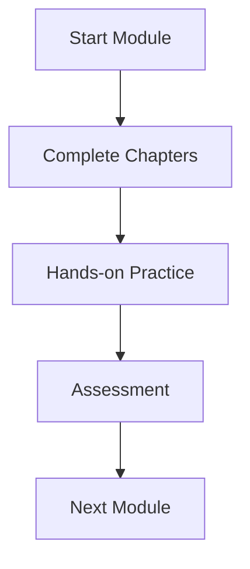

# Module {{MODULE_NUMBER}}: {{MODULE_TITLE}}

**Duration**: {{WEEKS}} weeks
**Focus**: {{FOCUS_AREA}}

## Learning Objectives

By the end of this module, you will be able to:

- {{OBJECTIVE_1}}
- {{OBJECTIVE_2}}
- {{OBJECTIVE_3}}
- {{OBJECTIVE_4}}
- {{OBJECTIVE_5}}

## Prerequisites

Before starting this module, you should have:

- {{PREREQUISITE_1}}
- {{PREREQUISITE_2}}
- {{PREREQUISITE_3}}

## Module Structure

This module contains the following chapters:

1. **[{{CHAPTER_1_TITLE}}](./{{CHAPTER_1_SLUG}})** - {{CHAPTER_1_DESCRIPTION}}
2. **[{{CHAPTER_2_TITLE}}](./{{CHAPTER_2_SLUG}})** - {{CHAPTER_2_DESCRIPTION}}
3. **[{{CHAPTER_3_TITLE}}](./{{CHAPTER_3_SLUG}})** - {{CHAPTER_3_DESCRIPTION}}
4. **[{{CHAPTER_4_TITLE}}](./{{CHAPTER_4_SLUG}})** - {{CHAPTER_4_DESCRIPTION}}

## Topics Covered

- {{TOPIC_1}}
- {{TOPIC_2}}
- {{TOPIC_3}}
- {{TOPIC_4}}
- {{TOPIC_5}}

## Assessment

This module includes a practical assessment to validate your understanding:

**{{ASSESSMENT_TITLE}}**

{{ASSESSMENT_DESCRIPTION}}

📝 **[View Assessment Details](./assessment.mdx)**

## Diagrams and Visual Aids

This module includes {{DIAGRAM_COUNT}} diagrams and visualizations to enhance understanding:

*Figure {{MODULE_NUMBER}}.1: Module learning flow*

## Module Summary

{{MODULE_SUMMARY}}

---

## Navigation

- **Previous Module**: [Module {{PREV_MODULE}}](../module-{{PREV_MODULE}}/)
- **Next Module**: [Module {{NEXT_MODULE}}](../module-{{NEXT_MODULE}}/)
- **[View All Modules](../../)**

## Estimated Time

- **Reading**: {{READING_HOURS}} hours
- **Hands-on Practice**: {{PRACTICE_HOURS}} hours
- **Assessment**: {{ASSESSMENT_HOURS}} hours
- **Total**: {{TOTAL_HOURS}} hours

---

**Last Updated**: {{LAST_UPDATED}}
**Version**: {{VERSION}}
