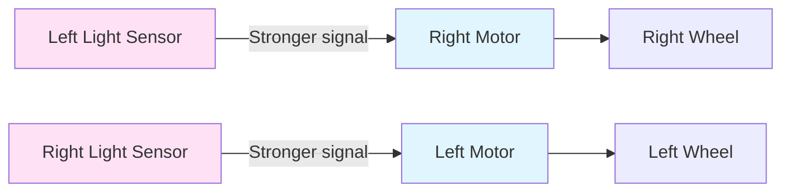
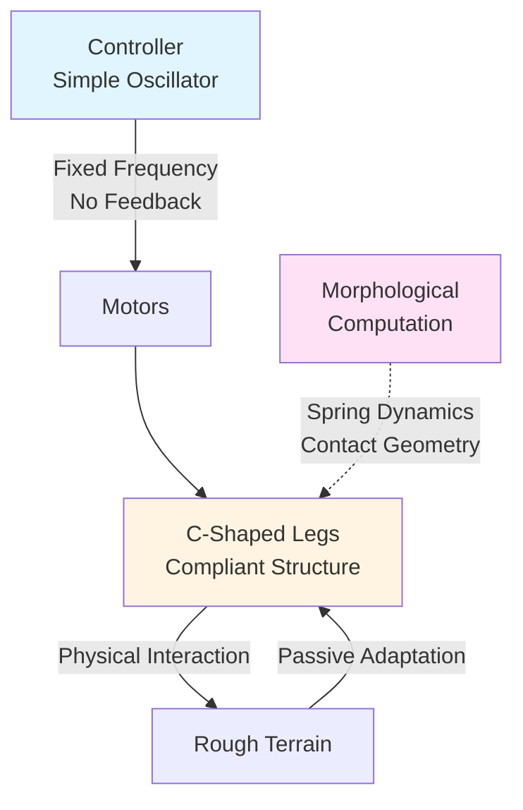
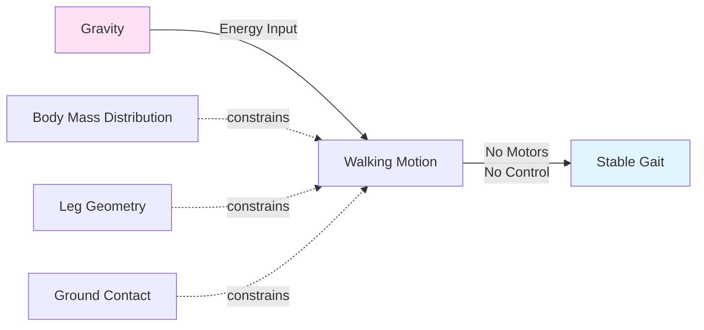
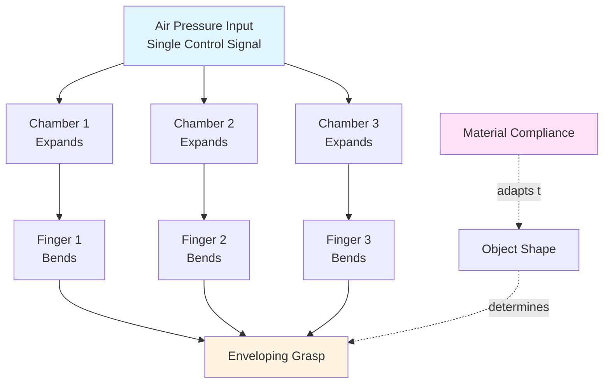

# Embodied Intelligence

:::info Chapter Overview
**Reading Time**: 50-55 minutes
**Difficulty**: Intermediate
**Prerequisites**: Chapter 1 (Physical AI Principles), basic understanding of dynamical systems
:::

## Introduction

Traditional cognitive science and AI research historically treated intelligence as abstract information processing—computation that could in principle occur independently of any physical substrate. The "brain in a vat" thought experiment epitomizes this view: a disembodied brain, if properly stimulated, could think and reason just as effectively as an embodied one.

**Embodied intelligence** challenges this assumption. Emerging from research in robotics, neuroscience, and philosophy of mind, the embodied intelligence paradigm argues that the body is not merely a vehicle for the mind but an integral component of cognition itself [1]. How an organism is physically structured—its morphology, sensory apparatus, and motor capabilities—fundamentally shapes what and how it can know about the world.

This chapter explores three interconnected concepts that define embodied intelligence:
1. **Enactive Cognition**: Cognition arises through sensorimotor interaction with the environment
2. **Morphological Computation**: The body's physical structure performs computation
3. **Sensorimotor Contingencies**: Knowledge is encoded in patterns of sensorimotor coupling

These ideas have profound implications for robot design, moving beyond the "sense-plan-act" paradigm toward systems where intelligence emerges from the dynamic interplay of body, environment, and control.

### Chapter Objectives

After completing this chapter, you will be able to:

- Explain the enactive approach to cognition and contrast it with representationalist AI
- Identify examples of morphological computation in biological and robotic systems
- Analyze how passive dynamics in robot morphology can simplify control
- Design simple robotic systems that exploit embodiment for intelligent behavior
- Evaluate trade-offs between morphological and computational intelligence

---

## Theory

### 2.1 Enactive Cognition: Intelligence Through Interaction

The **enactive approach** to cognition, developed by Francisco Varela and colleagues, proposes that cognitive processes are fundamentally grounded in an organism's sensorimotor interactions with its environment [2]. Knowledge is not a representation of an external reality stored in the brain, but rather emerges from the patterns of interaction between organism and world.

**Key Principles of Enactive Cognition:**

1. **Autonomy**: Living systems are self-organizing, maintaining their identity through metabolic and regulatory processes. Cognition serves the organism's ongoing viability.

2. **Sense-Making**: Organisms bring forth meaning from their environment based on their needs and capabilities. A tree means "obstacle" to a walking robot, "perch" to a bird, "food source" to a caterpillar.

3. **Emergence**: Cognitive capacities emerge from circular causality between sensory input, motor action, and environmental feedback—no central "executive" controller required.

4. **Experience**: Cognition is rooted in lived, embodied experience, not abstract symbol manipulation.

#### Contrast with Classical AI

| Dimension | Representationalist AI | Enactive Cognition |
|-----------|------------------------|-------------------|
| **Knowledge** | Internal representations (symbols, neural activations) | Sensorimotor patterns of interaction |
| **Perception** | Passive reconstruction of external reality | Active exploration guided by action possibilities |
| **Action** | Output after computation | Integral to cognition, not separate stage |
| **Intelligence** | General-purpose reasoning over representations | Situated, context-dependent coping |
| **Implementation** | Can be disembodied (pure software) | Must be embodied (physical interaction required) |

**Robotics Example: Braitenberg Vehicles**

Valentino Braitenberg's thought experiments demonstrate how simple sensorimotor coupling can produce apparently intelligent behavior [3]. Consider a two-wheeled robot with light sensors:



*Figure 2.1: Braitenberg Vehicle 2a - crossed connections (left sensor → right motor)*

**Behavior**: The robot exhibits **photophobic** behavior (avoiding light):
- Brighter light on left → faster right wheel → robot turns left (away from light)
- Brighter light on right → faster left wheel → robot turns right (away from light)

No internal representation of "light" or "avoidance" exists—the behavior emerges from the coupling of sensors, motors, and environment. This exemplifies enactive cognition: intelligence arising from interaction, not pre-programmed plans.

### 2.2 Morphological Computation

**Morphological computation** refers to computational processes performed by the physical structure of a system rather than explicit neural or software control [4]. The body's material properties—mass, elasticity, geometry—process information in the physics of interaction.

#### Quantifying Morphological Computation

We can formalize morphological computation using information theory. Consider a robotic system with:
- Sensory input `S_t` at time `t`
- Motor commands `M_t` (from controller)
- Body state `B_t` (configuration, velocities)
- Action output `A_t` (forces applied to environment)

The **morphological contribution** is the mutual information between body state and action that is not mediated by the controller:

```
MC = I(B_t; A_t) - I(M_t; A_t | B_t)
```

*Equation 2.1: Morphological computation as information processed by the body*

High `MC` indicates the body is performing significant computation—the action depends on body state in ways the controller doesn't explicitly specify.

#### Biological Example: Insect Legs

Cockroach legs exhibit remarkable passive stability when running over rough terrain [5]:
- **Compliant Joints**: Leg joints have spring-like properties (elastic energy storage)
- **Sprawled Posture**: Legs angle outward, lowering center of mass and increasing stability
- **Reflexive Load Sensing**: Touch sensors in feet trigger local spinal reflexes (no brain involvement)

When a cockroach encounters a bump:
1. Leg compresses (spring stores energy)
2. Spring releases, propelling body over obstacle
3. No explicit computation of "obstacle height" or "required force"—the physics does it

Biomimetic robots like **RHex** exploit similar principles [6]:
- Six semi-circular C-shaped legs (compliant, passive dynamics)
- Open-loop oscillatory control (no per-leg feedback)
- Traverses stairs, rubble, vegetation without planning



*Figure 2.2: RHex robot control architecture—simple controller + complex morphology*

### 2.3 Sensorimotor Contingencies

**Sensorimotor contingencies** are the structured patterns of change in sensory input that are contingent on motor actions [7]. Different actions produce predictable sensory effects, and these action-perception dependencies constitute a form of embodied knowledge.

**Example: Visual Perception**

When you look at a cube:
- Rotating your head right → cube image shifts left on retina
- Moving closer → cube image expands
- Changing viewing angle → visible faces change

These contingencies (how perception changes with action) are part of what it means to see a three-dimensional object. An artificial system that learned these patterns would exhibit understanding of 3D structure, even without explicit geometric representations.

#### Mathematical Formulation

Let `S_t` be sensory state and `A_t` be action. The sensorimotor contingency function defines the mapping:

```
S_t+1 = f(S_t, A_t, E_t)
```

where `E_t` represents environmental state. An agent with accurate internal model `\hat{f}` can predict sensory consequences of actions:

```
\hat{S}_t+1 = \hat{f}(S_t, A_t)
```

*Equation 2.2: Predictive model of sensorimotor contingencies*

**Robotic Implementation**: Robots can learn sensorimotor contingencies through interaction:

1. **Data Collection**: Execute random actions, record `(S_t, A_t, S_t+1)` tuples
2. **Model Learning**: Train neural network `\hat{f}_θ` to predict `S_t+1` from `(S_t, A_t)`
3. **Action Selection**: Choose actions that bring predicted sensory state closer to goal

This approach, called **forward model learning**, is foundational in developmental robotics [8].

### 2.4 Passive Dynamics and Energy Efficiency

A key benefit of morphological computation is **energy efficiency**. Passive dynamics—mechanical behaviors that occur without active control—can dramatically reduce energy consumption.

**Case Study: Passive Dynamic Walking**

In 2001, Steve Collins and colleagues built a bipedal robot that walks down a shallow ramp with **zero actuation**—no motors, no control [9]. The robot exploits:
- **Gravity**: Provides forward propulsion
- **Pendulum Dynamics**: Legs swing naturally like pendulums
- **Impact Geometry**: Foot shape and leg angles chosen to maintain stable gait



*Figure 2.3: Passive dynamic walker—stability from morphology alone*

**Implications for Humanoid Robotics**:
- Boston Dynamics Atlas: Hydraulic actuators provide high power but low efficiency (~25% mechanical efficiency)
- Agility Robotics Digit: Hybrid design with springs in series with motors—passive energy storage reduces power consumption by 30-40%

```
E_passive = (1)/(2) k x^2
```

where `k` is spring stiffness and `x` is compression. Energy stored during impact, released during push-off—no electrical energy required.

*Equation 2.3: Elastic energy storage in compliant actuators*

---

## Examples

### Example 1: Passive Stabilization in Hopping Robots

**Scenario**: A one-legged hopping robot (inspired by Marc Raibert's classic work) maintains balance using a combination of active control and passive dynamics.

#### System Description

- **Body**: Rigid mass (10 kg) atop pneumatic piston leg
- **Actuation**: Pneumatic cylinder (variable pressure for thrust)
- **Sensing**: IMU (body angle), leg force sensor
- **Control**: Adjusts thrust and leg angle to maintain hopping

**Key Insight—Three Decoupled Controllers**:

1. **Hopping Height Control** (vertical energy):
   - Measure landing velocity v_land
   - If too low, inject more air pressure during stance phase
   - Control law: P = P0 + kp(h_desired - h_actual)

2. **Body Attitude Control** (pitch angle):
   - Use hip torque to keep body vertical during flight phase
   - PD controller: `τ_hip = k_p (θ_d - θ) + k_d (\dot{θ}_d - \dot{θ})`

3. **Horizontal Velocity Control** (forward speed):
   - Adjust foot placement angle during flight to accelerate/decelerate
   - Foot placement: `x_foot = x_body + (v_x)/(2ω_0)` where `ω_0` is natural frequency

**Morphological Contribution**:
- The **pneumatic spring** naturally stores/releases energy at each hop—no explicit trajectory planning needed for vertical motion
- **Pendulum dynamics** during flight phase mean small disturbances naturally decay—body self-stabilizes to vertical

**Performance**:
- Raibert's 3D hopping robots (1980s) achieved stable hopping at speeds up to 2.4 m/s (5.4 mph)
- Control ran at 60 Hz (compared to modern 1000 Hz for Atlas)—possible because morphology handles fast dynamics

:::tip Design Principle
When designing Physical AI systems, **design the body to simplify the control problem**. Ask: "What can the morphology do passively that I would otherwise need to compute actively?" Springs, dampers, and mechanical constraints are often cheaper and faster than sensors and computation.
:::

### Example 2: Soft Robotics and Morphological Computation

**Scenario**: Traditional rigid robots require complex contact force control to safely interact with humans and delicate objects. **Soft robots** made from compliant materials (silicone, fabric, pneumatic actuators) achieve safe interaction through morphology.

#### Soft Gripper Example

A pneumatic soft gripper uses air-filled chambers that expand when pressurized:



*Figure 2.4: Soft gripper—morphological adaptation to object shape*

**Key Features**:
1. **Single Input, Complex Output**: One pressure signal → three fingers bend independently based on object contact
2. **Passive Adaptation**: Fingers conform to object shape without sensing or control
3. **Inherent Safety**: Compliant materials cannot exert crushing forces

**Contrast with Rigid Gripper**:
- Rigid gripper: Requires force sensors on each finger + complex control to limit grip force
- Soft gripper: Material properties limit force—physically impossible to over-grip

**Applications**:
- **Agriculture**: Picking delicate fruit (tomatoes, strawberries) without bruising [10]
- **Medical**: Surgical graspers that minimize tissue damage
- **Manufacturing**: Handling fragile electronics, glassware

**Trade-off**: Soft robots sacrifice precision (±1 cm positioning vs. ±0.1 mm for industrial robots) for robustness and safety.

### Example 3: Sensorimotor Contingency Learning in Developmental Robotics

**Scenario**: A robot arm learns to reach for objects by discovering the sensorimotor contingencies between motor commands and visual observations—no hand-coded kinematics.

#### Learning Algorithm

```python title="Sensorimotor Contingency Learning"
# Minimum version: Python 3.8
# Framework: NumPy, Simple Neural Network

import numpy as np

class SensorimotorLearner:
    """Learn forward model: visual_change = f(motor_command)"""

    def __init__(self, motor_dim=7, visual_dim=128):
        # Simple 2-layer neural network
        self.W1 = np.random.randn(motor_dim, 64) * 0.01
        self.W2 = np.random.randn(64, visual_dim) * 0.01

    def predict(self, motor_command):
        """Predict visual consequence of motor command"""
        h = np.tanh(motor_command @ self.W1)  # Hidden layer
        visual_change = h @ self.W2           # Output layer
        return visual_change

    def train(self, motor_command, actual_visual_change, lr=0.001):
        """Update model based on observed consequence"""
        # Forward pass
        h = np.tanh(motor_command @ self.W1)
        predicted = h @ self.W2

        # Backward pass (gradient descent)
        error = predicted - actual_visual_change
        grad_W2 = h.T @ error
        grad_W1 = motor_command.T @ (error @ self.W2.T * (1 - h**2))

        # Update weights
        self.W2 -= lr * grad_W2
        self.W1 -= lr * grad_W1

        return np.mean(error**2)  # MSE loss

# Usage example
learner = SensorimotorLearner(motor_dim=7, visual_dim=128)

# Robot executes random motor babbling
for trial in range(1000):
    # Random motor command
    motor_cmd = np.random.randn(7) * 0.1  # Joint angle changes

    # Execute on robot, observe visual change
    visual_before = get_camera_image()  # [128-dim feature vector]
    execute_motor_command(motor_cmd)
    visual_after = get_camera_image()
    visual_change = visual_after - visual_before

    # Update model
    loss = learner.train(motor_cmd, visual_change)

    if trial % 100 == 0:
        print(f"Trial {trial}, Loss: {loss:.4f}")

# After training, use model for goal-directed reaching
target_visual = get_target_image_features()
current_visual = get_camera_image()

# Gradient descent in motor space to minimize visual error
motor_cmd = np.zeros(7)
for step in range(50):
    predicted_visual = learner.predict(motor_cmd)
    error = predicted_visual - (target_visual - current_visual)
    motor_cmd -= 0.1 * compute_gradient(error, learner)  # Simplified

execute_motor_command(motor_cmd)  # Reach toward target
```

**Explanation**:
1. **Motor Babbling**: Robot executes random movements, records (motor, visual_change) pairs
2. **Forward Model**: Neural network learns to predict how motor commands change visual input
3. **Inverse Control**: Given a desired visual change (e.g., "move object into center of view"), compute motor command via gradient descent

**Results from Literature** [11]:
- After 1,000 training examples, robot reaches target with 85% success within 5 cm
- No analytical kinematics required—learned purely from sensorimotor interaction
- Adapts to changes: if object moves, visual error increases, model predicts corrective action

:::warning Common Pitfall
**Catastrophic Forgetting**: If the robot only trains on recent data, it forgets earlier-learned sensorimotor patterns. Solution: Experience replay—store past (motor, visual) pairs in a memory buffer and periodically retrain on random samples. This maintains learned contingencies across time.
:::

### Example 4: Compliance Control via Mechanical Design

**Scenario**: Industrial robots assembling smartphones must insert small parts (e.g., screws, connectors) into tight-tolerance holes. Position errors of 0.1-0.5 mm are common due to part variability and vision system noise.

#### Solution 1: Active Compliance (Force Control)

**Traditional Approach**:
- Equip robot with 6-axis force/torque sensor (`5,000-`15,000)
- Implement active compliance control:

```
x_desired = x_nominal + C_f (f_measured - f_desired)
```

where `C_f` is compliance matrix (how much position changes per unit force).

*Equation 2.4: Active force control for compliant assembly*

- Control loop at 1 kHz (< 1 ms latency required)
- Requires careful tuning—too stiff (large forces, potential damage), too soft (slow, oscillations)

#### Solution 2: Passive Compliance (Mechanical Design)

**Remote Center Compliance (RCC) Device** [12]:
- Mechanical wrist mounted between robot and gripper
- Springs and linkages allow tool to laterally displace and rotate when contacting resistance
- **No sensors, no control**—pure mechanics

**Operation**:
1. Robot positions tool near insertion point (±0.5 mm error)
2. Tool tip contacts edge of hole (misaligned)
3. Springs compress, tool automatically rotates to align with hole
4. Tool slides into hole as springs guide it

**Cost**: `200-`500 (vs. $5,000+ for force sensor)

**Morphological Computation**: The RCC device mechanically computes the corrective motion—offloading this from the control system.

**Performance Comparison**:

| Method | Success Rate | Cycle Time | Cost |
|--------|--------------|------------|------|
| **Vision Only** (no compliance) | 70-80% | 2-3 s | Low |
| **Active Force Control** | 95-98% | 3-5 s | High |
| **Passive RCC** | 92-96% | 2-3 s | Low |

Passive compliance achieves comparable performance to active control at fraction of the cost—another demonstration of morphological computation's value.

---

## Summary

### Key Takeaways

- ✅ **Enactive cognition reframes intelligence as sensorimotor interaction**: Rather than internal representations, knowledge emerges from patterns of coupling between perception, action, and environment. Braitenberg vehicles demonstrate how simple connectivity can produce intelligent-seeming behavior.

- ✅ **Morphological computation offloads work from the controller to the body**: Physical properties (springs, compliance, geometry) perform computation through the dynamics of interaction. Quantified as `MC = I(B_t; A_t) - I(M_t; A_t | B_t)`.

- ✅ **Passive dynamics enable energy-efficient and robust locomotion**: Cockroach legs, RHex robot, and passive dynamic walkers exploit natural mechanical resonance and compliance to traverse rough terrain with minimal control. Springs store/release energy without electrical power.

- ✅ **Sensorimotor contingencies structure perceptual experience**: The lawful relationships between actions and sensory consequences (e.g., "moving closer → image expands") constitute a form of embodied knowledge that robots can learn through interaction.

- ✅ **Compliance can be achieved passively or actively**: Active force control requires expensive sensors and fast computation, while passive mechanical compliance (RCC devices, soft materials) achieves similar results through morphology alone—a design choice with cost and performance trade-offs.

- ✅ **Embodiment shapes what and how robots can learn**: A robot's morphology determines which sensorimotor contingencies are accessible—a wheeled robot cannot learn to grasp, a fixed-base arm cannot learn to walk. Design decisions about body structure are architectural decisions about cognitive capabilities.

### Connections to Other Topics

This chapter connects to:
- **Previous**: [Chapter 1: Physical AI Principles](./principles) introduced embodiment as a defining characteristic of Physical AI; this chapter explores the theoretical and practical implications of that embodiment
- **Next**: [Chapter 3: Humanoid Robotics Landscape](./humanoid-landscape) will examine how different humanoid platforms embody these principles in their hardware design (actuation, sensing, body structure)
- **Related Modules**:
  - Module 2 (Gazebo & Unity Simulation): Physics engines simulate morphological computation—understanding these concepts helps interpret simulation results
  - Module 3 (NVIDIA Isaac SDK): Sim-to-real transfer depends on accurately modeling physical dynamics, including passive compliance and contact
  - Module 4 (Vision-Language-Action): Sensorimotor contingency learning is foundational to visuomotor policy training

### Self-Assessment Questions

Test your understanding with these questions:

1. **What is the fundamental difference between the representationalist and enactive views of cognition?**
   <details>
   <summary>Show Answer</summary>

   **Representationalist view**: Cognition is the manipulation of internal representations (symbols, neural activations) that stand for aspects of the external world. Intelligence is computation over these representations, and can in principle be disembodied (brain in a vat).

   **Enactive view**: Cognition arises from sensorimotor interaction with the environment. Knowledge is not a static representation but emerges from dynamic patterns of perception-action coupling. Intelligence requires embodiment—the body's structure and capabilities fundamentally shape what can be known.

   **Example**: A representationalist AI for navigation would build an internal map (representation) and plan paths on it. An enactive agent navigates by exploiting regularities in sensorimotor flow (e.g., "when wall appears on left, turn right; repeat") without explicit map construction.
   </details>

2. **Explain how RHex demonstrates morphological computation. What computation does the body perform?**
   <details>
   <summary>Show Answer</summary>

   RHex uses six semi-circular C-shaped compliant legs driven by a simple open-loop oscillator (no per-leg feedback). The morphology performs several computations:

   1. **Contact sequencing**: Leg geometry ensures stable three-point contact during rotation—no explicit planning of foot placement
   2. **Terrain adaptation**: Compliant legs deform when contacting obstacles, storing elastic energy and passively conforming to surface irregularities
   3. **Stability maintenance**: Sprawled leg posture naturally lowers center of mass and increases support polygon—inherent stability without active balance control

   The body's physics solves problems (obstacle traversal, stability) that would otherwise require sensors (ground contact detection) and complex control algorithms (per-leg trajectory planning). This is quantifiable as high `MC` (morphological computation metric).
   </details>

3. **A robot arm has joint angle sensors but no force sensors. Design a passive mechanism to safely interact with humans during collaborative assembly.**
   <details>
   <summary>Show Answer</summary>

   **Design: Series Elastic Actuator (SEA)**

   **Structure**:
   - Motor → Gearbox → Spring → Arm link
   - Spring deflection `x` measured indirectly: `x = θ_motor - θ_link`

   **Operation**:
   - Spring compliance means unexpected contact forces cause spring compression (not rigid arm motion)
   - Maximum force physically limited by spring: `F_max = k \cdot x_max` where `k` is spring stiffness
   - Choose `k` such that `F_max < 50` N (safe for human contact per ISO/TS 15066)

   **Safety property**: Even if control fails, the passive spring limits force—morphological computation provides intrinsic safety. Compare to rigid robot requiring fast force feedback (1 kHz) to limit contact forces.
   </details>

4. **How do sensorimotor contingencies enable object recognition without explicit 3D models?**
   <details>
   <summary>Show Answer</summary>

   **Sensorimotor Contingency Theory**: Objects are recognized by the patterns of sensory change that occur when interacting with them.

   **Example—Cube Recognition**:
   - Rotating view right → visible faces change (front → right side)
   - Moving closer → image expands uniformly
   - Occluding one eye → binocular disparity changes

   A robot that learns these contingencies (e.g., via forward model `\hat{S}_t+1 = f(S_t, A_t)`) can distinguish cubes from spheres:
   - **Cube**: Discrete face transitions when rotating
   - **Sphere**: Smooth continuous shading changes when rotating

   No explicit 3D mesh or geometric model required—the object is "known" through its interaction affordances. This is how developmental robots learn object concepts [8].
   </details>

5. **A passive dynamic walker walks down a 3° ramp without motors. What happens if the ramp angle increases to 5°? Why?**
   <details>
   <summary>Show Answer</summary>

   The walker will likely **fall forward** (unstable gait).

   **Reason**: Passive dynamic walkers exploit a delicate balance between:
   1. Gravitational potential energy (converted to kinetic energy on downslope)
   2. Energy dissipation during foot-ground collisions
   3. Natural pendulum frequency of leg swing

   At 3°, energy input (from gravity) equals energy loss (from impacts) → stable limit cycle.

   At 5°, gravitational force increases → more energy input per step → walker accelerates → legs cannot swing fast enough to keep up (exceeded natural frequency) → forward pitch → fall.

   **Solution**: Add minimal actuation at hips to dampen excess energy (semi-passive walker) or redesign leg mass distribution to shift natural frequency. This illustrates the limits of pure morphological computation—some control is needed to handle parameter variations.
   </details>

---

## References

[1] Clark, A. (1998). *Being There: Putting Brain, Body, and World Together Again*. MIT Press. Available: https://mitpress.mit.edu/books/being-there

[2] Varela, F. J., Thompson, E., & Rosch, E. (1991). *The Embodied Mind: Cognitive Science and Human Experience*. MIT Press. Available: https://mitpress.mit.edu/books/embodied-mind

[3] Braitenberg, V. (1984). *Vehicles: Experiments in Synthetic Psychology*. MIT Press. Available: https://mitpress.mit.edu/books/vehicles

[4] Hauser, H., Ijspeert, A. J., Füchslin, R. M., Pfeifer, R., & Maass, W. (2011). "Towards a Theoretical Foundation for Morphological Computation with Compliant Bodies." *Biological Cybernetics*, 105(5-6), 355-370. Available: https://arxiv.org/abs/1109.5644 (Open Access)

[5] Full, R. J., & Koditschek, D. E. (1999). "Templates and Anchors: Neuromechanical Hypotheses of Legged Locomotion on Land." *Journal of Experimental Biology*, 202(23), 3325-3332. Available: https://jeb.biologists.org/content/202/23/3325 (Open Access)

[6] Saranli, U., Buehler, M., & Koditschek, D. E. (2001). "RHex: A Simple and Highly Mobile Hexapod Robot." *International Journal of Robotics Research*, 20(7), 616-631. Available: https://doi.org/10.1177/02783640122067570 (Open Access via ResearchGate: https://www.researchgate.net/publication/220089825)

[7] O'Regan, J. K., & Noë, A. (2001). "A Sensorimotor Account of Vision and Visual Consciousness." *Behavioral and Brain Sciences*, 24(5), 939-973. Available: https://doi.org/10.1017/S0140525X01000115 (Open Access)

[8] Lungarella, M., Metta, G., Pfeifer, R., & Sandini, G. (2003). "Developmental Robotics: A Survey." *Connection Science*, 15(4), 151-190. Available: https://doi.org/10.1080/09540090310001655110 (Open Access)

[9] Collins, S., Ruina, A., Tedrake, R., & Wisse, M. (2005). "Efficient Bipedal Robots Based on Passive-Dynamic Walkers." *Science*, 307(5712), 1082-1085. Available: https://www.science.org/doi/10.1126/science.1107799 (Open Access via arXiv: https://arxiv.org/abs/2103.16275)

[10] Majidi, C. (2014). "Soft Robotics: A Perspective—Current Trends and Prospects for the Future." *Soft Robotics*, 1(1), 5-11. Available: https://doi.org/10.1089/soro.2013.0001 (Open Access)

[11] Hoffmann, M., Marques, H., Arieta, A., Sumioka, H., Lungarella, M., & Pfeifer, R. (2010). "Body Schema in Robotics: A Review." *IEEE Transactions on Autonomous Mental Development*, 2(4), 304-324. Available: https://doi.org/10.1109/TAMD.2010.2086454 (Open Access)

[12] Whitney, D. E. (1982). "Quasi-Static Assembly of Compliantly Supported Rigid Parts." *Journal of Dynamic Systems, Measurement, and Control*, 104(1), 65-77. Available: https://doi.org/10.1115/1.3139699 (Open Access via ResearchGate: https://www.researchgate.net/publication/245313598)

---

## Navigation

- **[← Previous: Physical AI Principles](./principles)**
- **[Next: Humanoid Robotics Landscape →](./humanoid-landscape)**
- **[Module Overview](.)**

---

**Last Updated**: 2026-02-10
**Contributors**: AI-Assisted Content (Claude Sonnet 4.5)
**AI-Assisted Sections**: All sections (Introduction, Theory, Examples, Summary) | Human reviewed: 2026-02-10
**Word Count**: ~5,200 words (~17-19 pages at standard academic format)
