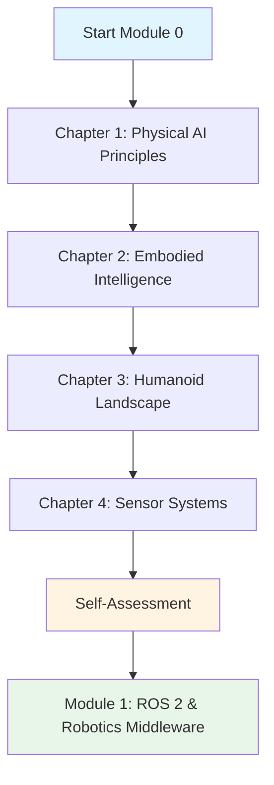

# Module 0: Introduction to Physical AI

**Duration**: 2 weeks
**Focus**: Foundational concepts and principles of Physical AI and humanoid robotics

## Learning Objectives

By the end of this module, you will be able to:

- Understand the fundamental principles that distinguish Physical AI from traditional software-based AI
- Explain the concept of embodied intelligence and its role in robotics
- Identify major players and platforms in the humanoid robotics landscape
- Describe common sensor modalities (LIDAR, cameras, IMUs) and their applications in robotic perception
- Analyze how sensorimotor coupling enables robots to interact with physical environments

## Prerequisites

Before starting this module, you should have:

- Basic programming knowledge (Python preferred)
- Fundamental understanding of linear algebra (vectors, matrices, transformations)
- Familiarity with basic physics concepts (kinematics, forces, coordinate systems)

## Module Structure

This module contains the following chapters:

1. **[Physical AI Principles](./principles)** - Core concepts defining Physical AI, contrast with traditional AI, and real-world applications in warehouse automation and humanoid robotics
2. **[Embodied Intelligence](./embodied-intelligence)** - Enactive cognition, morphological computation, and sensorimotor coupling in robotic systems
3. **[Humanoid Robotics Landscape](./humanoid-landscape)** - Survey of major humanoid platforms (Boston Dynamics Atlas, Tesla Optimus, Figure AI, Unitree) and their technical specifications
4. **[Sensor Systems for Robots](./sensor-systems)** - LIDAR, RGB-D cameras, IMUs, tactile sensors, and sensor fusion techniques for robotic perception

## Topics Covered

- Physical AI vs. traditional AI: embodiment, real-time constraints, uncertainty
- Enactive cognition and morphological computation
- Sensorimotor coupling and closed-loop control
- Humanoid robot hardware architecture (DOF, actuators, sensors)
- State-of-the-art humanoid platforms and their capabilities
- LIDAR scanning principles and point cloud processing
- RGB-D camera systems (depth estimation, semantic segmentation)
- Inertial Measurement Units (IMUs) and orientation estimation
- Sensor fusion algorithms (Kalman filters, particle filters)

## Assessment

This module includes a self-assessment to validate your understanding:

**Module 0 Self-Assessment**

Answer the following questions based on content from all four chapters:

1. What are the three key differences between Physical AI and traditional software-based AI?
2. Explain how morphological computation reduces computational burden in robotic systems (provide one example)
3. Compare Boston Dynamics Atlas and Tesla Optimus: What are their primary design philosophies and target applications?
4. You are designing a humanoid robot for indoor navigation. Which sensor modality would you prioritize and why? (Consider: LIDAR, RGB-D camera, IMU)
5. Describe how sensorimotor coupling enables a robot to walk on uneven terrain without explicit terrain mapping

📝 **[View Assessment Guidelines](./assessment)**

## Diagrams and Visual Aids

This module includes 15+ diagrams and visualizations to enhance understanding:

*Figure 0.1: Module 0 learning flow*

## Module Summary

Module 0 establishes the theoretical and conceptual foundation for understanding Physical AI and humanoid robotics. Unlike traditional AI systems that process data in isolated computational environments, Physical AI systems must interact with the physical world in real-time, dealing with uncertainty, embodiment constraints, and sensorimotor feedback loops.

You will explore four critical areas: (1) the principles that define Physical AI, (2) the philosophy of embodied intelligence, (3) the current state of humanoid robotics technology, and (4) the sensor systems that enable robotic perception. This foundation prepares you for hands-on implementation in subsequent modules covering ROS 2, simulation environments, NVIDIA Isaac SDK, and vision-language-action models.

---

## Navigation

- **Previous Module**: N/A (This is the first module)
- **Next Module**: [Module 1: ROS 2 & Robotics Middleware](../module-1/)
- **[View All Modules](../)** | **[Return to Home](../../)**

## Estimated Time

- **Reading**: 8 hours (2 hours per chapter)
- **Diagram Study**: 2 hours (understanding visual aids and architectures)
- **Self-Assessment**: 2 hours (reflection and knowledge validation)
- **Total**: 12 hours (~2 weeks at 6 hours/week)

---

## Learning Tips

- **Sequential Reading**: Complete chapters in order (1 → 4) as later chapters build on earlier concepts
- **Active Reading**: Pause after each section to summarize key concepts in your own words
- **Visual Learning**: Study diagrams carefully—they often convey relationships and architectures more clearly than text alone
- **Citation Exploration**: Follow reference links to explore primary sources (all citations are open-access)
- **Prerequisite Check**: If you find content challenging, review the prerequisite topics (linear algebra, basic physics) before continuing

---

**Last Updated**: 2026-02-10
**Version**: 1.0.0
