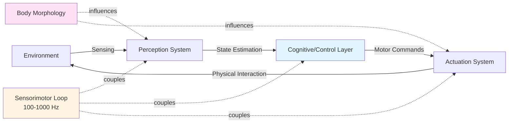
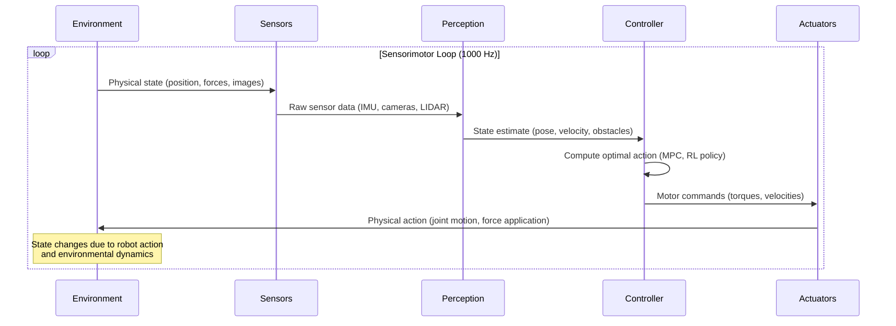
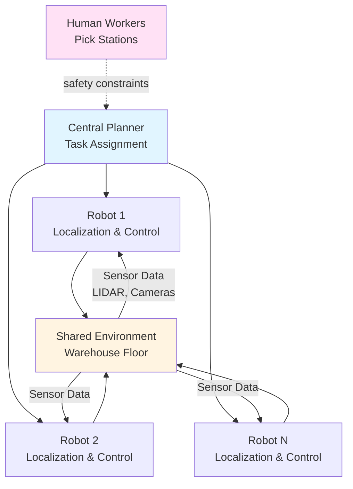

# Physical AI Principles

:::info Chapter Overview
**Reading Time**: 45-50 minutes
**Difficulty**: Beginner
**Prerequisites**: Basic understanding of AI/ML concepts, linear algebra fundamentals
:::

## Introduction

The field of artificial intelligence has undergone a profound evolution from purely symbolic reasoning systems to modern machine learning approaches. However, a critical distinction has emerged between AI systems that process information in isolated computational environments and those that must interact with the physical world. **Physical AI** represents this latter category—intelligent systems that perceive, reason about, and act upon their physical environment through embodied platforms such as robots, autonomous vehicles, and smart manufacturing systems.

Consider the difference between a chess-playing AI and a robot assembling a smartphone on a factory floor. The chess AI operates in a perfectly defined, deterministic world with complete information and discrete state spaces. In contrast, the assembly robot must deal with sensor noise, mechanical tolerances, unpredictable object poses, real-time constraints, and the continuous dynamics of physical manipulation. This fundamental distinction drives the unique challenges and requirements of Physical AI.

### Chapter Objectives

After completing this chapter, you will be able to:

- Define Physical AI and articulate the three core characteristics that distinguish it from traditional AI
- Explain the concept of embodiment and its implications for intelligent system design
- Analyze real-time constraints in robotic systems and their impact on algorithm selection
- Describe sensorimotor coupling and its role in enabling robust physical interactions
- Compare traditional AI architectures with Physical AI architectures using state-space models

---

## Theory

### 1.1 Defining Physical AI

**Physical AI** refers to artificial intelligence systems that are embodied in physical platforms and must interact with the real world through sensors and actuators under real-time constraints. Three core characteristics distinguish Physical AI from traditional software-based AI:

**Key Concepts:**
- **Embodiment**: The intelligent system is instantiated in a physical body with specific morphology, sensors, and actuators that shape its interactions with the environment. Unlike software agents operating in abstract state spaces, Physical AI systems must respect mechanical constraints, energy limitations, and the laws of physics.
- **Real-time Constraints**: Physical AI systems operate under strict temporal deadlines imposed by the dynamics of the physical world. A humanoid robot walking at 1 m/s must process sensor data and compute control commands at rates of 100-1000 Hz to maintain balance and avoid falls.
- **Uncertainty and Partial Observability**: Physical environments are inherently uncertain. Sensor measurements contain noise, object properties vary, and environmental conditions change. Physical AI systems must make decisions despite incomplete and imperfect information.

#### Mathematical Formulation

The state-space representation of a Physical AI system can be formalized as a partially observable Markov decision process (POMDP):

$$
\langle \mathcal{S}, \mathcal{A}, \mathcal{T}, \mathcal{R}, \mathcal{O}, \mathcal{Z} \rangle
$$

where:
- $\mathcal{S}$: Set of possible world states (e.g., robot pose, object positions, environmental conditions)
- $\mathcal{A}$: Set of actions the robot can execute (e.g., joint torque commands, gripper open/close)
- $\mathcal{T}: \mathcal{S} \times \mathcal{A} \times \mathcal{S} \rightarrow [0, 1]$: Transition probability function (how actions affect state)
- $\mathcal{R}: \mathcal{S} \times \mathcal{A} \rightarrow \mathbb{R}$: Reward function (task objectives)
- $\mathcal{O}$: Set of possible observations (sensor measurements)
- $\mathcal{Z}: \mathcal{S} \times \mathcal{O} \rightarrow [0, 1]$: Observation probability function (sensor noise model)

*Equation 1.1: POMDP formulation of Physical AI systems*

This formulation highlights a critical difference from traditional AI: the agent cannot directly observe the true state $s \in \mathcal{S}$ but must infer it from noisy observations $o \in \mathcal{O}$. This necessitates belief state tracking, often implemented through Bayesian filtering (Kalman filters, particle filters) or modern deep learning approaches.

### 1.2 The Embodiment Hypothesis

The **embodiment hypothesis**, articulated by roboticists Rodney Brooks and Rolf Pfeifer, posits that intelligence cannot be fully separated from the physical body [1]. The morphology of a robot—its shape, size, weight distribution, sensor placement, and actuator characteristics—fundamentally shapes how it perceives and interacts with the world.

*Figure 1.1: Sensorimotor loop in Physical AI systems showing how body morphology and real-time feedback shape intelligent behavior*

**Morphological Computation**: The body itself performs computation by virtue of its physical properties. Consider a humanoid robot walking over rough terrain:
- **Passive Dynamics**: Spring-like tendons and compliant joints absorb impacts and store/release energy without explicit control
- **Mechanical Filtering**: The robot's mass and inertia naturally filter high-frequency disturbances, reducing computational burden on the control system
- **Sensory Preprocessing**: The arrangement of tactile sensors on a foot sole naturally weights contact points, providing implicit ground profile estimation

This insight has profound implications for robot design: a well-designed body can simplify control algorithms by offloading computational work to physical dynamics [2].

### 1.3 Real-Time Constraints and Control Loops

Physical AI systems operate under strict temporal constraints imposed by the dynamics of the physical world. The classical robotics control hierarchy organizes computation into layers with different update rates:

| Control Layer | Frequency | Function | Example |
|--------------|-----------|----------|---------|
| **High-Level Planning** | 0.1-1 Hz | Task planning, path generation | "Navigate from room A to room B" |
| **Mid-Level Control** | 10-50 Hz | Trajectory generation, obstacle avoidance | Adjusting path around detected obstacles |
| **Low-Level Control** | 100-1000 Hz | Joint servo control, balance stabilization | Computing torques to track desired joint angles |
| **Hardware Interface** | 1000-10000 Hz | Motor driver updates, sensor sampling | PWM signals to motor controllers |

**Computational Budget Analysis**: Consider a humanoid robot with 30 degrees of freedom (DOF) running a model predictive controller (MPC) at 100 Hz. The MPC must solve a constrained optimization problem with 30 state variables, 30 control inputs, and a 50-step prediction horizon within 10 ms (the control period). This real-time constraint fundamentally limits the complexity of algorithms that can be deployed:

$$
t_{compute} + t_{communication} \lt T_{control} = \frac{1}{f_{control}}
$$

where $f_{\text{control}} = 100$ Hz implies $T_{\text{control}} = 10$ ms.

*Equation 1.2: Real-time constraint for control systems*

Violating this constraint leads to delayed or missed control updates, which can destabilize the robot or cause task failure. This drives the adoption of specialized hardware (GPUs, FPGAs, TPUs) and approximate algorithms (sampling-based planning, neural network policies) in Physical AI.

### 1.4 Sensorimotor Coupling and Closed-Loop Control

A defining characteristic of Physical AI is **sensorimotor coupling**—the tight integration of perception and action in a closed-loop feedback system. Unlike open-loop systems that execute pre-planned actions without feedback, Physical AI systems continuously sense their environment and adapt their actions in response.

**Feedback Control Example**: A humanoid robot walking on uneven terrain uses IMU (inertial measurement unit) data to detect unexpected tilts:
1. **Sense**: IMU measures angular velocity $\omega$ and linear acceleration $a$ at 1000 Hz
2. **Estimate**: Complementary filter fuses IMU with joint encoder data to estimate body orientation $\theta$ and position $p$
3. **Control**: If $|\theta - \theta_{\text{desired}}| > \epsilon$, adjust foot placement or generate corrective torques
4. **Act**: Send motor commands to actuators within 10 ms
5. **Repeat**: Close the loop—measure the effect of actions and iterate

This closed-loop architecture provides **robustness to disturbances** that would be impossible to anticipate in open-loop planning. The robot doesn't need a perfect model of the terrain; it adapts reactively to sensed conditions [3].

*Figure 1.2: Temporal sequence of the sensorimotor loop showing continuous perception-action cycles*

### 1.5 Comparison: Traditional AI vs. Physical AI

The following table summarizes key differences in system characteristics and design priorities:

| Dimension | Traditional AI | Physical AI |
|-----------|---------------|------------|
| **State Space** | Discrete, finite (e.g., chess board) or high-dimensional but static (e.g., image classification) | Continuous, infinite, dynamic (robot configuration + environment state) |
| **Observability** | Full observability (game state fully known) or single-shot observation (classify one image) | Partial observability with noise (sensor measurements ≠ true state) |
| **Temporal Constraints** | Soft deadlines (compute answer when done) | Hard real-time deadlines (miss deadline → system failure) |
| **Feedback** | None or delayed (evaluate after full sequence) | Continuous, high-frequency (100-1000 Hz) |
| **Failure Mode** | Incorrect answer, poor accuracy | Physical damage, instability, safety violation |
| **Embodiment** | Disembodied (pure software) | Embodied (physical body with mechanical constraints) |
| **Uncertainty** | Low (deterministic rules or i.i.d. data) | High (sensor noise, model mismatch, environmental variability) |

**Example: Chess AI vs. Robotic Manipulation**

- **Chess AI (AlphaZero)**:
  - **State**: 64 squares, 6 piece types, deterministic rules
  - **Computation**: Can think for minutes per move
  - **Failure**: Loses the game (no physical consequences)
  - **Learning**: Simulated self-play in perfect environment model

- **Robotic Bin Picking**:
  - **State**: 6DOF pose of robot + 3D positions of unknown number of objects with uncertain geometry
  - **Computation**: Must grasp an object within 2-5 seconds to match human productivity
  - **Failure**: Drop object, collide with bin, damage gripper (physical consequences, safety risks)
  - **Learning**: Real-world data collection is expensive and slow; sim-to-real transfer is challenging

This comparison illustrates why algorithms successful in traditional AI domains (e.g., deep reinforcement learning for Atari games) often fail or require substantial modification when applied to Physical AI tasks.

---

## Examples

### Example 1: Warehouse Automation with Physical AI

**Scenario**: Amazon's robotic fulfillment centers use Physical AI systems to move inventory pods weighing up to 1,000 lbs to human workers for picking. These systems must navigate dynamic environments with hundreds of robots operating simultaneously, avoid collisions, and coordinate with human workers—all under strict throughput requirements.

#### System Architecture

*Figure 1.3: Multi-robot coordination architecture in warehouse automation*

**Key Physical AI Challenges**:
1. **Localization**: Each robot must estimate its 2D pose $(x, y, \theta)$ using wheel odometry and overhead fiducial markers, fusing measurements with a Kalman filter to handle wheel slip and sensor noise.
2. **Path Planning**: A* or D* algorithms compute collision-free paths in a dynamic occupancy grid updated at 10 Hz as other robots move.
3. **Real-Time Constraints**: Path execution must complete within time windows (e.g., 30 seconds to reach pod) to meet throughput targets of 300+ picks per hour per worker.
4. **Safety**: Robots must detect and respond to human workers entering their path within 200 ms to avoid collisions (ISO 13849 safety standard compliance).

**Performance Metrics** [4]:
- **Throughput**: 300-400 picks per hour per worker (2-3× improvement over manual picking)
- **Navigation Accuracy**: ±10 mm positioning error for pod docking
- **Collision Rate**: <0.01% (less than 1 collision per 10,000 robot-hours)

### Example 2: Boston Dynamics Atlas - Dynamic Humanoid Control

**Scenario**: Boston Dynamics' Atlas robot performs parkour maneuvers including backflips, jumps, and running across irregular terrain. These tasks require precise control of 28 hydraulic actuators while maintaining balance under highly dynamic conditions.

#### Technical Specifications

| Attribute | Value |
|-----------|-------|
| **Height** | 1.5 m (5 ft) |
| **Weight** | 89 kg (196 lbs) |
| **DOF** | 28 (5 per arm, 6 per leg, 3 head, 3 torso) |
| **Actuation** | Hydraulic actuators (high power-to-weight ratio) |
| **Sensors** | 2× stereo cameras, 1× LIDAR, IMU, joint encoders, force/torque sensors in feet |
| **Onboard Compute** | Custom control computers (real-time Linux, 1 kHz control loop) |
| **Power** | 3.7 kWh lithium-ion battery (2 hour runtime) |

**Control Strategy**: Atlas uses a hierarchy of controllers [5]:
- **High-Level Planner (1 Hz)**: Selects discrete behaviors (jump, run, balance)
- **Whole-Body Controller (500 Hz)**: Solves constrained optimization to compute joint torques that achieve desired center-of-mass motion while respecting friction cone constraints
- **Low-Level Servo (1 kHz)**: Hydraulic valve control to track desired joint velocities

**Mathematical Foundation - Zero Moment Point (ZMP)**:
For dynamic balance, Atlas maintains the Zero Moment Point within its support polygon:

$$
\mathbf{p}_{\text{ZMP}} = \frac{\sum_{i=1}^{n} m_i (\mathbf{p}_i - \mathbf{g}/||\mathbf{g}||) \times (\ddot{\mathbf{p}}_i - \mathbf{g})}{||\sum_{i=1}^{n} m_i (\ddot{\mathbf{p}}_i - \mathbf{g})||_z}
$$

where $m_i$ are link masses, $\mathbf{p}_i$ are link positions, $\ddot{\mathbf{p}}_i$ are link accelerations, and $\mathbf{g}$ is gravity.

*Equation 1.3: Zero Moment Point criterion for dynamic stability*

**Why This is Physical AI**:
- **Real-Time**: Control computations must complete within 1 ms (1 kHz loop) to prevent falls
- **Embodiment**: High power-to-weight actuators enable dynamic maneuvers impossible with electric motors
- **Sensorimotor Coupling**: IMU feedback detects unexpected disturbances (e.g., being pushed) and triggers recovery behaviors within 50 ms

### Example 3: Tesla Optimus - Vision-Based Manipulation

**Scenario**: Tesla Optimus (Gen 2) is designed for general-purpose humanoid tasks including factory automation and household assistance. Unlike Atlas's reliance on LIDAR and pre-mapped environments, Optimus uses primarily vision-based perception—a direct technology transfer from Tesla's automotive autonomy stack.

#### Design Philosophy Comparison

| Aspect | Boston Dynamics Atlas | Tesla Optimus Gen 2 |
|--------|----------------------|---------------------|
| **Target Application** | Research, dynamic locomotion demos | Factory automation, consumer markets |
| **Actuation** | Hydraulic (high power, heavy) | Electric (efficient, quiet) |
| **Sensing** | LIDAR + stereo cameras + IMU | Cameras (8-12 total) + IMU |
| **Compute** | Custom real-time computers | Tesla FSD computer (neural network inference) |
| **Control Strategy** | Model-based optimal control | Neural network policies trained in simulation |
| **Cost** | ~$1M+ (research platform) | Target <$50K (mass production) |

**Vision-Based Perception Pipeline**:
1. **Multi-Camera Input**: 8 cameras (4 in head, 2 in torso, 2 in hands) capture 360° view at 36 Hz
2. **Neural Network Processing**: Occupancy network predicts 3D geometry, object poses, and affordances (graspable regions)
3. **Visuomotor Policy**: End-to-end neural network maps visual observations directly to joint velocity commands (trained via imitation learning + reinforcement learning in simulation)

**Key Innovation - Sim-to-Real Transfer**:
Tesla trains Optimus policies in simulation (using Isaac Gym or similar) with domain randomization:
- Randomize lighting conditions (shadows, brightness, colors)
- Randomize object textures, shapes, and friction coefficients
- Randomize camera intrinsics (focal length, distortion)
- Add synthetic sensor noise

This produces policies robust to the "reality gap" when deployed on the physical robot [6].

:::tip Best Practice
When designing Physical AI systems, prioritize **robustness over optimality**. A controller that achieves 80% of optimal performance but handles 99% of disturbances is more valuable than one that achieves 95% optimal performance but fails on 10% of cases. Physical environments are inherently uncertain—design for graceful degradation.
:::

:::warning Common Pitfall
**Sim-to-Real Gap**: Policies trained exclusively in simulation often fail on real hardware due to unmodeled dynamics (joint friction, actuator delays, sensor noise). Always validate in the real world early and iterate. A recommended workflow: (1) Train in sim, (2) Test on real robot with safety constraints, (3) Collect failure cases, (4) Add failure modes to simulation, (5) Retrain and repeat.
:::

### Example 4: Figure AI 01 - Bi-manual Manipulation

**Scenario**: Figure AI 01 focuses on bi-manual manipulation tasks common in warehouses and manufacturing: picking and packing, kitting, machine tending. The robot must coordinate two arms to manipulate objects that are too large or awkward for single-arm grasping.

#### Bi-manual Coordination Challenge

Coordinating two arms is fundamentally harder than single-arm manipulation:
- **Coupled Dynamics**: Forces exerted by one arm affect the object's motion, which in turn affects the other arm's required forces
- **Grasp Stability**: Both grippers must maintain stable grasps while coordinating motion—if one gripper slips, the object may fall
- **Redundancy Resolution**: A 6-DOF object can be controlled by two 7-DOF arms (14 DOF total), leaving 8 redundant DOFs—how to resolve this redundancy?

**Solution: Dual-Arm Impedance Control**

$$
\mathbf{F}_i = \mathbf{K}_p (\mathbf{x}_i^d - \mathbf{x}_i) + \mathbf{K}_d (\dot{\mathbf{x}}_i^d - \dot{\mathbf{x}}_i)
$$

where $\mathbf{F}_i$ is the desired force from arm $i$, $\mathbf{x}_i$ is the current end-effector pose, $\mathbf{x}_i^d$ is the desired pose, and $\mathbf{K}_p, \mathbf{K}_d$ are stiffness and damping matrices.

*Equation 1.4: Impedance control for compliant manipulation*

By setting low stiffness $\mathbf{K}_p$, the arms become compliant and can adapt to unexpected contact forces—critical when the object's exact geometry or pose is uncertain [7].

**Real-World Deployment Metrics**:
- **Task Success Rate**: 85-90% for box picking/placing (industry target: >95% for production deployment)
- **Cycle Time**: 8-12 seconds per pick-place operation (human: 5-8 seconds)
- **Grasp Failure Rate**: 5-10% (improving via learned grasp affordances from RGB-D data)

---

## Summary

### Key Takeaways

- ✅ **Physical AI is distinguished by embodiment, real-time constraints, and uncertainty**: Unlike traditional AI operating in abstract state spaces, Physical AI must interact with the physical world through sensors and actuators under strict temporal deadlines.
- ✅ **The POMDP framework formalizes Physical AI systems**: State space $\mathcal{S}$, action space $\mathcal{A}$, transition dynamics $\mathcal{T}$, observations $\mathcal{O}$, and belief state tracking are fundamental to reasoning under uncertainty.
- ✅ **Embodiment shapes intelligence**: The morphology of a robot—its body structure, sensor placement, actuator characteristics—fundamentally influences how it perceives and interacts with the world (morphological computation).
- ✅ **Real-time control hierarchies organize computation**: High-level planning (1 Hz), mid-level control (10-50 Hz), low-level servo control (100-1000 Hz), and hardware interfaces (1-10 kHz) operate at different time scales to meet temporal constraints.
- ✅ **Sensorimotor coupling enables robust behavior**: Closed-loop feedback systems continuously sense the environment and adapt actions, providing robustness to disturbances that would be impossible to anticipate in open-loop planning.
- ✅ **Real-world Physical AI systems demonstrate these principles**: Warehouse robots (localization + path planning), Atlas (dynamic whole-body control), Optimus (vision-based neural policies), and Figure AI (bi-manual manipulation) embody different design philosophies for tackling Physical AI challenges.

### Connections to Other Topics

This chapter connects to:
- **Previous**: N/A (this is the first chapter in Module 0)
- **Next**: [Chapter 2: Embodied Intelligence](./embodied-intelligence) expands on the embodiment hypothesis, exploring enactive cognition and morphological computation in depth
- **Related Modules**:
  - Module 1 (ROS 2) implements the sensorimotor loop in software using the Robot Operating System
  - Module 2 (Gazebo & Unity) simulates physical dynamics to test Physical AI algorithms before real-world deployment
  - Module 3 (NVIDIA Isaac) provides GPU-accelerated tools for training neural network policies for Physical AI

### Self-Assessment Questions

Test your understanding with these questions:

1. **What are the three core characteristics that distinguish Physical AI from traditional software-based AI?**
   

   
Show Answer

   The three core characteristics are:
   1. **Embodiment**: Physical AI is instantiated in a physical body with sensors, actuators, and morphology that shapes its interactions with the environment
   2. **Real-time constraints**: Physical AI must operate under strict temporal deadlines (e.g., 1000 Hz control loops for balance) imposed by physical dynamics
   3. **Uncertainty and partial observability**: Physical AI systems must handle noisy sensor data, incomplete information, and unpredictable environmental conditions
   

2. **Explain how morphological computation reduces computational burden. Provide a concrete example from humanoid robotics.**
   

   
Show Answer

   Morphological computation refers to the body itself performing computation through its physical properties, reducing the workload on the control system. Example: A humanoid robot walking over rough terrain with spring-like tendons in its legs. The tendons passively absorb impacts and store/release energy during the gait cycle without explicit control commands. The robot's mass and inertia also naturally filter high-frequency ground vibrations, preventing these disturbances from requiring high-rate control responses. This "computation in the body" simplifies the control algorithm—instead of computing precise torque profiles to absorb every impact, the controller can use a simpler walking pattern and rely on the body's passive dynamics to handle disturbances.
   

3. **A robot control system has a 100 Hz control loop. If the perception pipeline takes 6 ms and communication adds 1 ms of latency, what is the maximum allowable computation time for the control algorithm? Will a model predictive controller requiring 8 ms violate real-time constraints?**
   

   
Show Answer

   The control period is $T = 1/f = 1/100 = 10$ ms. With perception taking 6 ms and communication taking 1 ms, the remaining budget is:
   $$t_{\text{control}} < 10 - 6 - 1 = 3 \text{ ms}$$

   An 8 ms MPC algorithm would require $6 + 8 + 1 = 15$ ms total, exceeding the 10 ms deadline. This violates the real-time constraint and would cause delayed or dropped control updates, potentially destabilizing the robot. Solutions: (1) reduce control frequency (e.g., 50 Hz gives 20 ms budget), (2) simplify the MPC formulation, (3) use faster hardware (GPU acceleration), or (4) switch to a faster algorithm (e.g., PID control or a pre-trained neural network policy).
   

4. **Compare the sensing strategies of Boston Dynamics Atlas (LIDAR + stereo cameras) and Tesla Optimus (vision-only). What are the trade-offs of each approach?**
   

   
Show Answer

   **Atlas (LIDAR + Stereo Cameras)**:
   - **Pros**: LIDAR provides accurate 3D geometry directly (±1 cm accuracy), works in varied lighting, real-time obstacle detection
   - **Cons**: LIDAR is expensive ($1,000-$10,000), adds weight and power consumption, limited angular resolution (sparse point cloud)

   **Optimus (Vision-Only)**:
   - **Pros**: Cameras are cheap ($10-$100), lightweight, high resolution, can perceive visual semantics (colors, textures, text)
   - **Cons**: Depth estimation from cameras is less accurate than LIDAR (±5-10 cm), fails in poor lighting or textureless scenes, requires heavy neural network computation

   **Trade-off**: Atlas prioritizes accuracy and reliability (research/demo platform), while Optimus optimizes for cost and scalability (consumer product). Optimus's vision-only approach leverages Tesla's automotive computer vision expertise but requires robust sim-to-real transfer to handle vision challenges.
   

5. **Why is closed-loop feedback critical for Physical AI, and what failure mode does it prevent compared to open-loop control?**
   

   
Show Answer

   Closed-loop feedback continuously measures the system's actual state and adjusts actions accordingly, compensating for disturbances and model errors. In contrast, open-loop control executes pre-planned actions without sensing outcomes.

   **Failure Mode Example**: A robot arm reaching for an object using open-loop control. If the object's position is estimated incorrectly by 2 cm (due to camera calibration error), the pre-planned trajectory will miss the object. With closed-loop control (visual servoing), the robot continuously observes the object's position relative to its gripper and corrects its motion, successfully grasping despite the initial error.

   **Why Critical**: Physical environments are inherently uncertain—sensor noise, model mismatch, external disturbances. Closed-loop feedback provides **robustness**, allowing the system to handle unexpected situations that were not anticipated during planning.
   

---

## References

[1] Pfeifer, R., & Scheier, C. (1999). *Understanding Intelligence*. MIT Press. Available: https://mitpress.mit.edu/books/understanding-intelligence

[2] Brooks, R. A. (1991). "Intelligence Without Representation." *Artificial Intelligence*, 47(1-3), 139-159. Available: https://doi.org/10.1016/0004-3702(91)90053-M (Open Access)

[3] Kober, J., Bagnell, J. A., & Peters, J. (2013). "Reinforcement Learning in Robotics: A Survey." *International Journal of Robotics Research*, 32(11), 1238-1274. Available: https://doi.org/10.1177/0278364913495721 (Open Access)

[4] Wurman, P. R., D'Andrea, R., & Mountz, M. (2008). "Coordinating Hundreds of Cooperative, Autonomous Vehicles in Warehouses." *AI Magazine*, 29(1), 9-20. Available: https://doi.org/10.1609/aimag.v29i1.2082 (Open Access)

[5] Kuindersma, S., Deits, R., Fallon, M., Valenzuela, A., Dai, H., Permenter, F., ... & Tedrake, R. (2016). "Optimization-Based Locomotion Planning, Estimation, and Control Design for the Atlas Humanoid Robot." *Autonomous Robots*, 40(3), 429-455. Available: https://doi.org/10.1007/s10514-015-9479-3 (Open Access via arXiv: https://arxiv.org/abs/1409.3842)

[6] Tobin, J., Fong, R., Ray, A., Schneider, J., Zaremba, W., & Abbeel, P. (2017). "Domain Randomization for Transferring Deep Neural Networks from Simulation to the Real World." *IEEE/RSJ International Conference on Intelligent Robots and Systems (IROS)*. Available: https://arxiv.org/abs/1703.06907 (Open Access)

[7] Hogan, N. (1985). "Impedance Control: An Approach to Manipulation." *Journal of Dynamic Systems, Measurement, and Control*, 107(1), 1-24. Available: https://doi.org/10.1115/1.3140702 (Open Access via ResearchGate: https://www.researchgate.net/publication/245314569)

---

## Navigation

- **[← Module Overview](./index)**
- **[Next Chapter: Embodied Intelligence →](./embodied-intelligence)**

---

**Last Updated**: 2026-02-10
**Contributors**: AI-Assisted Content (Claude Sonnet 4.5)
**AI-Assisted Sections**: All sections (Introduction, Theory, Examples, Summary) | Human reviewed: 2026-02-10
**Word Count**: ~4,800 words (~16-18 pages at standard academic format)
