# Sensor Systems for Robots

:::info Chapter Overview
**Reading Time**: 50-55 minutes
**Difficulty**: Intermediate
**Prerequisites**: Chapter 1 (Physical AI Principles), basic linear algebra, understanding of coordinate frames
:::

## Introduction

Perception—the ability to sense and interpret the environment—is foundational to Physical AI. Unlike software agents operating in well-defined digital environments, robots must extract information from noisy, high-dimensional sensor data: laser range measurements, camera pixels, inertial accelerations, force readings. The **sensor system** transforms raw physical measurements into actionable representations for decision-making and control.

This chapter examines four sensor modalities critical to humanoid robotics:

1. **LIDAR (Light Detection and Ranging)**: Provides accurate 3D geometry via laser scanning
2. **RGB-D Cameras**: Combines visual appearance with depth information
3. **IMUs (Inertial Measurement Units)**: Measures orientation, angular velocity, and linear acceleration
4. **Tactile Sensors**: Detects contact forces and object properties through touch

We then explore **sensor fusion**—algorithms that combine multiple sensor streams to produce more accurate and robust estimates than any single sensor alone.

### Chapter Objectives

After completing this chapter, you will be able to:

- Explain the operating principles of LIDAR, RGB-D cameras, and IMUs
- Analyze sensor trade-offs (accuracy, cost, range, update rate) for robotic applications
- Implement basic sensor processing algorithms (point cloud filtering, depth map processing)
- Design sensor fusion systems using Kalman filters
- Evaluate sensor configurations for humanoid robot perception tasks

---

## Theory

### 4.1 LIDAR: 3D Geometry from Laser Ranging

**LIDAR** (Light Detection and Ranging) measures distance by emitting laser pulses and timing their reflection from surfaces. The result is a **point cloud**—a set of 3D points $(x, y, z)$ representing surfaces in the environment.

#### 4.1.1 Operating Principle

**Time-of-Flight Measurement**:
1. Laser emitter sends short pulse (1-10 ns duration)
2. Pulse travels to surface, reflects back
3. Detector measures round-trip time $t$
4. Distance computed: d = ct/2 where c = 3 × 10<sup>8</sup> m/s (speed of light)

```
d = (c × t) / 2
```

*Equation 4.1: LIDAR distance measurement via time-of-flight*

**Accuracy**: Typical LIDAR achieves ±1-3 cm range accuracy at 10-100 m distances.

#### 4.1.2 Scanning Mechanisms

**2D LIDAR** (planar scan):
- Single laser rotates 360° in one plane
- Output: Range measurements at angular intervals (e.g., 0.25° resolution → 1,440 points/scan)
- Applications: Mobile robot navigation, obstacle detection

**3D LIDAR** (volumetric scan):
- Multiple lasers stacked vertically + horizontal rotation, or
- Single laser with vertical and horizontal scanning mirrors
- Output: 3D point cloud (e.g., Velodyne HDL-64E: 64 lasers, 1.3M points/sec)
- Applications: Autonomous vehicles, humanoid perception

```mermaid
graph TD
    A[LIDAR Sensor] --> B[Laser Emitter]
    A --> C[Rotating Mirror/Head]
    A --> D[Photodetector]

    B -->|Laser Pulse| E[Environment Surface]
    E -->|Reflected Light| D
    D -->|Time-of-Flight| F[Distance Calculation]
    C -->|Angle θ, φ| F
    F --> G[Point Cloud<br/>x, y, z coords]

    style A fill:#e1f5ff
    style G fill:#fff4e1
```



*Figure 4.1: LIDAR system architecture—laser pulses reflect from surfaces, time-of-flight determines distance*

#### 4.1.3 Point Cloud Representation

A point cloud is a set of $N$ 3D points:

$$
\mathcal{P} = \{(x_i, y_i, z_i) \mid i = 1, ..., N\}
$$

Each point may also carry **intensity** (reflectivity of surface) and **label** (semantic class).

**Coordinate Frame**: Points are expressed relative to LIDAR sensor frame. Transformation to robot body frame or world frame requires:

$$
\mathbf{p}_{\text{world}} = \mathbf{R}_{\text{sensor}}^{\text{world}} \mathbf{p}_{\text{sensor}} + \mathbf{t}_{\text{sensor}}^{\text{world}}
$$

where $\mathbf{R}$ is rotation matrix (3×3) and $\mathbf{t}$ is translation vector (3×1).

*Equation 4.2: Coordinate transformation for point clouds*

#### 4.1.4 Advantages and Limitations

| Aspect | LIDAR |
|--------|-------|
| **Accuracy** | Excellent (±1-3 cm) |
| **Range** | Long (10-100 m) |
| **Lighting** | Independent (active sensing) |
| **Cost** | High ($1,000-$10,000+) |
| **Resolution** | Sparse (1-2M points/sec typical) |
| **Materials** | Fails on transparent/reflective surfaces (glass, mirrors) |
| **Weather** | Degrades in rain, fog, snow (scattering) |

### 4.2 RGB-D Cameras: Visual Appearance + Depth

**RGB-D cameras** capture both color images (RGB) and per-pixel depth measurements, combining the semantic richness of vision with 3D geometric information.

#### 4.2.1 Depth Sensing Technologies

**Stereo Vision** (e.g., Intel RealSense D435):
- Two cameras separated by baseline $b$ (e.g., 50 mm)
- Match corresponding pixels in left and right images
- Compute depth from disparity $d$:

$$
z = \frac{fb}{d}
$$

where $f$ is focal length, $b$ is baseline, $d$ is pixel disparity (difference in x-coordinate between matched pixels).

*Equation 4.3: Stereo depth from disparity*

**Structured Light** (e.g., Microsoft Kinect v1, Primesense):
- Project known pattern (e.g., infrared dots) onto scene
- Observe pattern deformation with IR camera
- Depth inferred from pattern distortion

**Time-of-Flight (ToF)** (e.g., Microsoft Kinect v2, Photoneo):
- Similar to LIDAR but uses modulated light (e.g., 20 MHz sine wave)
- Measure phase shift of reflected light
- Depth: $z = \frac{c \phi}{4\pi f}$ where $\phi$ is phase shift, $f$ is modulation frequency

*Equation 4.4: Time-of-Flight depth measurement*

#### 4.2.2 Depth Map Representation

RGB-D cameras produce an **aligned depth map**: for each RGB pixel $(u, v)$, there is a corresponding depth value $z(u, v)$.

**Conversion to 3D Point**:

$$
\begin{bmatrix} x \\ y \\ z \end{bmatrix} = z \begin{bmatrix} (u - c_x) / f_x \\ (v - c_y) / f_y \\ 1 \end{bmatrix}
$$

where $(c_x, c_y)$ is principal point (image center) and $(f_x, f_y)$ are focal lengths in pixels.

*Equation 4.5: 3D back-projection from RGB-D pixel*

#### 4.2.3 Advantages and Limitations

| Aspect | RGB-D Camera |
|--------|--------------|
| **Accuracy** | Moderate (±1-5 cm at 1-3 m range) |
| **Range** | Short (0.5-10 m depending on technology) |
| **Lighting** | Stereo: Needs texture; ToF/Structured: Independent |
| **Cost** | Low ($50-$500) |
| **Resolution** | Dense (640×480 to 1920×1080 pixels) |
| **Semantic Info** | Yes (color provides object recognition cues) |
| **Compute** | Stereo: High (matching); ToF: Low |

**Use Cases**:
- **Indoor Navigation**: RGB-D cameras excel in structured environments (homes, offices) where range is limited
- **Manipulation**: Dense depth maps enable precise grasp pose estimation
- **Human Interaction**: RGB provides facial recognition, gesture tracking

### 4.3 Inertial Measurement Units (IMUs)

**IMUs** measure a robot's motion using accelerometers and gyroscopes. Unlike external sensors (LIDAR, cameras), IMUs provide **proprioceptive** information—the robot's sense of its own motion.

#### 4.3.1 Sensor Components

**3-Axis Gyroscope**: Measures angular velocity $\boldsymbol{\omega} = (\omega_x, \omega_y, \omega_z)$ in rad/s around each axis.

**3-Axis Accelerometer**: Measures linear acceleration $\mathbf{a} = (a_x, a_y, a_z)$ in m/s². Includes both:
- **Dynamic acceleration** (robot motion)
- **Gravitational acceleration** ($-9.81$ m/s² in Earth frame)

**3-Axis Magnetometer** (optional): Measures magnetic field direction—provides absolute heading (compass).

#### 4.3.2 Orientation Estimation

**Goal**: Estimate robot orientation $\mathbf{q}$ (as quaternion) from gyroscope and accelerometer readings.

**Complementary Filter** (simple, real-time):

1. **Gyroscope Integration** (high-frequency, no drift correction):
   $$
   \mathbf{q}_{\text{gyro}}(t+\Delta t) = \mathbf{q}(t) \otimes \exp\left(\frac{\Delta t}{2} \boldsymbol{\omega}\right)
   $$

2. **Accelerometer Tilt** (low-frequency, corrects drift):
   - Assumes $\mathbf{a} \approx \mathbf{g}$ (gravity) when robot is stationary
   - Compute orientation from gravity direction

3. **Fusion**:
   $$
   \mathbf{q}(t+\Delta t) = \alpha \mathbf{q}_{\text{gyro}} + (1-\alpha) \mathbf{q}_{\text{accel}}
   $$
   where $\alpha = 0.95-0.99$ (high-pass gyro, low-pass accel).

*Equation 4.6: Complementary filter for orientation estimation*

**Extended Kalman Filter (EKF)** (more accurate, handles sensor noise models):
- State: $\mathbf{x} = [\mathbf{q}, \boldsymbol{\omega}, \mathbf{b}_{\omega}]$ (orientation, angular velocity, gyro bias)
- Prediction: Integrate gyroscope
- Update: Correct with accelerometer + magnetometer

#### 4.3.3 Challenges

**Gyroscope Drift**: Integration of $\boldsymbol{\omega}$ accumulates errors over time → orientation drifts (1-10°/minute for consumer IMUs)

**Accelerometer Noise**: During dynamic motion, $\mathbf{a} \neq \mathbf{g}$ → cannot use accelerometer for tilt correction

**Magnetometer Distortion**: Indoor magnetic fields from electronics distort compass readings

**Solution**: Fuse IMU with external sensors (cameras, LIDAR) via Visual-Inertial Odometry (VIO) or LIDAR-Inertial Odometry (LIO).

### 4.4 Tactile Sensors

**Tactile sensors** measure contact forces and pressures through direct physical interaction—essential for manipulation tasks.

#### 4.4.1 Technologies

**Resistive Force Sensors** (FSRs):
- Resistance decreases under applied pressure
- Simple, cheap ($1-$10 per sensor)
- Low resolution, hysteresis (non-linear)

**Capacitive Sensors**:
- Capacitance changes with deformation of dielectric
- Higher resolution than FSRs
- More expensive ($50-$200)

**Optical Tactile Sensors** (e.g., GelSight):
- Camera observes deformation of gel surface in contact
- Extremely high resolution (sub-millimeter features)
- Expensive ($1,000+), bulky

#### 4.4.2 Applications in Humanoid Robotics

1. **Grasping Stability**: Detect slip → increase grip force
2. **Texture Recognition**: Differentiate materials (metal vs. plastic vs. fabric)
3. **Safety**: Detect unexpected contact with humans → stop motion

**Example—Slip Detection**:

```python title="Tactile Slip Detection"
# Minimum version: Python 3.8
# Framework: NumPy

import numpy as np

def detect_slip(tactile_readings, threshold=0.5):
    """
    Detect object slip from tactile sensor array.

    Args:
        tactile_readings: Array of force readings [N] at 1 kHz
        threshold: Slip detection threshold (normalized force change)

    Returns:
        bool: True if slip detected
    """
    # Compute temporal derivative of force
    force_derivative = np.diff(tactile_readings)

    # Slip occurs when force drops rapidly
    # (object moving relative to gripper)
    slip_detected = np.any(force_derivative < -threshold)

    return slip_detected

# Usage example
tactile_data = np.array([5.0, 5.1, 4.9, 5.0, 4.2, 3.1, 2.5])  # N
if detect_slip(tactile_data, threshold=0.5):
    print("⚠️ Slip detected - increasing grip force")
    increase_gripper_force()
```

---

## Examples

### Example 1: LIDAR-Based Obstacle Avoidance

**Scenario**: A humanoid robot walks through a cluttered warehouse. A 2D LIDAR mounted on its torso scans horizontally to detect obstacles.

#### Implementation

```python title="LIDAR Obstacle Avoidance"
# Minimum version: Python 3.8, ROS 2 Humble
# Framework: ROS 2 (rclpy), NumPy

import numpy as np
import rclpy
from sensor_msgs.msg import LaserScan
from geometry_msgs.msg import Twist

class ObstacleAvoider:
    def __init__(self):
        self.node = rclpy.create_node('obstacle_avoider')
        self.scan_sub = self.node.create_subscription(
            LaserScan, '/scan', self.scan_callback, 10)
        self.cmd_pub = self.node.create_publisher(Twist, '/cmd_vel', 10)

        self.safe_distance = 1.0  # meters

    def scan_callback(self, msg: LaserScan):
        """Process LIDAR scan and compute avoidance command"""
        ranges = np.array(msg.ranges)
        angles = np.linspace(msg.angle_min, msg.angle_max, len(ranges))

        # Filter invalid readings (inf, nan)
        valid = np.isfinite(ranges) & (ranges > msg.range_min)
        ranges = ranges[valid]
        angles = angles[valid]

        # Find closest obstacle
        min_range = np.min(ranges)
        min_angle = angles[np.argmin(ranges)]

        # Compute avoidance velocity
        cmd = Twist()
        if min_range < self.safe_distance:
            # Obstacle detected - turn away
            cmd.linear.x = 0.2  # Slow forward motion
            cmd.angular.z = -np.sign(min_angle) * 0.5  # Turn away
            print(f"⚠️ Obstacle at {min_range:.2f}m, angle {np.degrees(min_angle):.1f}°")
        else:
            # Clear path - normal walking speed
            cmd.linear.x = 0.5  # m/s
            cmd.angular.z = 0.0

        self.cmd_pub.publish(cmd)

# ROS 2 node execution
rclpy.init()
avoider = ObstacleAvoider()
rclpy.spin(avoider.node)
```

**Explanation**:
1. Subscribe to LIDAR scan topic (`/scan`)
2. Find closest obstacle in scan
3. If obstacle < 1 m away, slow down and turn away from it
4. Publish velocity command to robot controller

**Performance**:
- Update rate: 10-40 Hz (typical LIDAR scan rate)
- Reaction time: ~25-100 ms (acceptable for walking speed 0.5 m/s)

### Example 2: RGB-D Depth Map Processing for Grasping

**Scenario**: A robot arm equipped with an RGB-D camera (wrist-mounted) needs to find graspable objects on a table.

#### Algorithm

1. **Segmentation**: Identify table plane, remove it → remaining points are objects
2. **Clustering**: Group points into object clusters
3. **Grasp Pose Estimation**: For each cluster, compute grasp candidate poses

```python title="RGB-D Object Segmentation and Grasping"
# Minimum version: Python 3.10
# Framework: NumPy, OpenCV, Open3D

import numpy as np
import cv2
import open3d as o3d

def segment_objects_on_table(depth_image, camera_intrinsics):
    """
    Segment objects from RGB-D depth image.

    Args:
        depth_image: (H, W) array of depth values in meters
        camera_intrinsics: Camera calibration (fx, fy, cx, cy)

    Returns:
        List of object point clouds
    """
    fx, fy, cx, cy = camera_intrinsics

    # Convert depth map to 3D point cloud
    h, w = depth_image.shape
    u, v = np.meshgrid(np.arange(w), np.arange(h))
    z = depth_image
    x = (u - cx) * z / fx
    y = (v - cy) * z / fy

    # Stack into Nx3 point cloud
    points = np.stack([x, y, z], axis=-1).reshape(-1, 3)

    # Filter invalid points (z == 0 or z > max_range)
    valid = (points[:, 2] > 0.3) & (points[:, 2] < 2.0)
    points = points[valid]

    # Fit plane to table using RANSAC
    pcd = o3d.geometry.PointCloud()
    pcd.points = o3d.utility.Vector3dVector(points)
    plane_model, inliers = pcd.segment_plane(
        distance_threshold=0.01, ransac_n=3, num_iterations=1000)

    # Remove table plane → objects remain
    object_pcd = pcd.select_by_index(inliers, invert=True)

    # Cluster objects using DBSCAN
    labels = np.array(object_pcd.cluster_dbscan(
        eps=0.02, min_points=50))

    # Extract each cluster as separate object
    objects = []
    for label in np.unique(labels):
        if label == -1:  # Noise
            continue
        obj_indices = np.where(labels == label)[0]
        obj_pcd = object_pcd.select_by_index(obj_indices)
        objects.append(obj_pcd)

    return objects

def compute_grasp_pose(object_pcd):
    """
    Compute top-down grasp pose for object.

    Returns:
        Grasp pose (position, orientation)
    """
    # Compute object centroid
    center = np.mean(np.asarray(object_pcd.points), axis=0)

    # Top-down grasp: approach from above
    grasp_position = center + np.array([0, 0, 0.1])  # 10 cm above
    grasp_orientation = np.eye(3)  # Gripper pointing down

    return grasp_position, grasp_orientation

# Usage
depth = cv2.imread('depth_image.png', cv2.IMREAD_ANYDEPTH) / 1000.0  # mm → m
camera_intrinsics = (525.0, 525.0, 319.5, 239.5)  # RealSense D435

objects = segment_objects_on_table(depth, camera_intrinsics)
print(f"Detected {len(objects)} objects")

for i, obj in enumerate(objects):
    pos, ori = compute_grasp_pose(obj)
    print(f"Object {i}: Grasp at {pos}")
```

**Key Steps**:
1. **Depth to 3D**: Project depth pixels to 3D points using camera calibration
2. **Plane Fitting**: RANSAC finds table plane
3. **Clustering**: DBSCAN groups nearby points into objects
4. **Grasp Computation**: Simple top-down grasp at object centroid

**Performance**:
- Processing time: 50-200 ms (Intel i7 CPU)
- Segmentation accuracy: 85-95% for well-separated objects on table

### Example 3: IMU-Based Balance Control for Bipedal Walking

**Scenario**: A humanoid robot uses IMU data to detect loss of balance and trigger corrective actions.

#### Algorithm

```python title="IMU Balance Monitoring"
# Minimum version: Python 3.8
# Framework: NumPy, SciPy

import numpy as np
from scipy.spatial.transform import Rotation

class BalanceMonitor:
    def __init__(self, imu_rate=1000):  # Hz
        self.dt = 1.0 / imu_rate
        self.orientation = Rotation.identity()  # Quaternion
        self.angular_velocity = np.zeros(3)  # rad/s

        # Balance thresholds
        self.max_tilt_angle = np.radians(20)  # degrees
        self.max_angular_velocity = np.radians(50)  # deg/s

    def update(self, gyro_reading, accel_reading):
        """
        Update orientation estimate from IMU.

        Args:
            gyro_reading: (wx, wy, wz) in rad/s
            accel_reading: (ax, ay, az) in m/s²

        Returns:
            balance_status: "stable", "warning", or "critical"
        """
        # Gyroscope integration
        omega = gyro_reading
        self.angular_velocity = omega
        delta_q = Rotation.from_rotvec(omega * self.dt)
        self.orientation = self.orientation * delta_q

        # Accelerometer tilt correction (assumes stationary or slow motion)
        accel_norm = np.linalg.norm(accel_reading)
        if 0.8 * 9.81 < accel_norm < 1.2 * 9.81:
            # Close to 1g → likely stationary
            gravity_direction = accel_reading / accel_norm
            measured_tilt = np.arccos(np.dot(gravity_direction, [0, 0, -1]))

            # Simple complementary filter (95% gyro, 5% accel)
            accel_correction = Rotation.from_rotvec(
                0.05 * np.cross([0, 0, -1], gravity_direction))
            self.orientation = self.orientation * accel_correction

        # Check balance status
        tilt_angle = self.get_tilt_angle()
        angular_velocity_magnitude = np.linalg.norm(self.angular_velocity)

        if tilt_angle > self.max_tilt_angle or \
           angular_velocity_magnitude > self.max_angular_velocity:
            return "critical"  # Imminent fall
        elif tilt_angle > 0.7 * self.max_tilt_angle:
            return "warning"  # Approaching limit
        else:
            return "stable"

    def get_tilt_angle(self):
        """Compute tilt angle from vertical (radians)"""
        # Extract "up" direction in body frame
        body_up = self.orientation.apply([0, 0, 1])
        world_up = np.array([0, 0, 1])
        tilt = np.arccos(np.clip(np.dot(body_up, world_up), -1, 1))
        return tilt

# Usage in control loop (1 kHz)
monitor = BalanceMonitor(imu_rate=1000)

while True:
    gyro = read_gyroscope()  # rad/s
    accel = read_accelerometer()  # m/s²

    status = monitor.update(gyro, accel)

    if status == "critical":
        print("🚨 BALANCE CRITICAL - Emergency stop")
        trigger_fall_recovery()
    elif status == "warning":
        print("⚠️ Balance warning - Adjust foot placement")
        adjust_step_width()
```

**Explanation**:
- **Gyro Integration**: Compute orientation by integrating angular velocity
- **Accel Correction**: When robot is near-stationary, accelerometer measures gravity → correct gyro drift
- **Balance Check**: If tilt > 20° or angular velocity > 50°/s, trigger recovery behavior

**Performance**:
- Update rate: 1 kHz (typical for balance control)
- Orientation error: ±2-5° (with complementary filter)
- Reaction time: 1-10 ms (critical for preventing falls)

### Example 4: Sensor Fusion—Extended Kalman Filter for Pose Estimation

**Scenario**: Fuse IMU (high-rate, drifts) with visual odometry (low-rate, accurate) to estimate robot pose.

#### Extended Kalman Filter (EKF)

**State**: $\mathbf{x} = [x, y, z, q_w, q_x, q_y, q_z, v_x, v_y, v_z]$ (position, orientation quaternion, velocity)

**Prediction** (IMU at 1 kHz):
$$
\mathbf{x}_{k+1} = f(\mathbf{x}_k, \mathbf{u}_k) + \mathbf{w}_k
$$

where $\mathbf{u}_k$ is IMU measurement (accel, gyro) and $\mathbf{w}_k \sim \mathcal{N}(0, \mathbf{Q})$ is process noise.

**Update** (Visual odometry at 30 Hz):
$$
\mathbf{z}_k = h(\mathbf{x}_k) + \mathbf{v}_k
$$

where $\mathbf{z}_k$ is pose from vision and $\mathbf{v}_k \sim \mathcal{N}(0, \mathbf{R})$ is measurement noise.

*Equation 4.7: EKF prediction and update steps*

```mermaid
sequenceDiagram
    participant IMU
    participant EKF
    participant Vision
    participant Robot

    loop Every 1 ms (1 kHz)
        IMU->>EKF: Accel, Gyro
        EKF->>EKF: Predict state (integrate)
    end

    loop Every 33 ms (30 Hz)
        Vision->>EKF: Pose estimate (x, y, θ)
        EKF->>EKF: Update (correct drift)
    end

    EKF->>Robot: Fused pose estimate
```



*Figure 4.2: EKF sensor fusion timeline—IMU provides high-rate prediction, vision provides low-rate correction*

**Benefits**:
- **IMU** provides high-rate estimates (no gaps in data)
- **Vision** corrects accumulated IMU drift
- **EKF** computes optimal weighted average based on sensor noise covariances

**Typical Performance**:
- Position error: ±5-10 cm (vs. ±50 cm for IMU alone after 10 seconds)
- Orientation error: ±1-2° (vs. ±10° for IMU alone)

---

## Summary

### Key Takeaways

- ✅ **LIDAR provides accurate long-range 3D geometry**: Time-of-flight laser ranging achieves ±1-3 cm accuracy at 10-100 m, but high cost ($1K-$10K) and sparse data (1-2M points/sec) limit applications. Excellent for outdoor navigation and obstacle avoidance.

- ✅ **RGB-D cameras combine visual semantics with depth**: Stereo/ToF/structured light technologies provide dense depth maps (640×480+ pixels) at low cost ($50-$500), but limited range (0.5-10 m) and accuracy (±1-5 cm). Ideal for indoor manipulation and human interaction.

- ✅ **IMUs enable proprioceptive motion sensing**: Gyroscopes and accelerometers measure angular velocity and linear acceleration at high rates (100-1000 Hz), critical for balance control. However, gyro drift (1-10°/min) requires fusion with external sensors (cameras, LIDAR) for long-term accuracy.

- ✅ **Tactile sensors enable safe manipulation**: Force/pressure sensors detect contact, slip, and texture. Essential for dexterous grasping and human-robot collaboration. Technologies range from simple FSRs ($1-$10) to high-resolution optical sensors ($1,000+).

- ✅ **Sensor fusion combines complementary strengths**: Extended Kalman Filters (EKF) or particle filters fuse high-rate inertial data (IMU) with accurate but low-rate external measurements (vision, LIDAR), achieving position accuracy ±5-10 cm and orientation ±1-2°.

- ✅ **Sensor selection depends on application requirements**: Outdoor navigation → LIDAR (long range, lighting-independent); Indoor manipulation → RGB-D (dense, semantic-rich); Dynamic control → IMU (high-rate, proprioceptive). Cost, computational requirements, and environmental conditions constrain choices.

### Connections to Other Topics

This chapter connects to:
- **Previous**: [Chapter 3: Humanoid Robotics Landscape](./humanoid-landscape) described sensor configurations on major platforms—this chapter explains how those sensors work and why designers chose them
- **Next**: [Module 1: ROS 2 & Robotics Middleware](../module-1/) will show how to implement sensor processing pipelines using ROS 2 nodes and topics
- **Related Modules**:
  - Module 2 (Gazebo & Unity Simulation): Physics engines simulate LIDAR, cameras, IMUs—understanding sensor models is critical for accurate simulation
  - Module 3 (NVIDIA Isaac SDK): Provides GPU-accelerated perception pipelines (point cloud processing, depth map segmentation)
  - Module 4 (Vision-Language-Action): Vision models (GPT-4V, CLIP) process RGB camera images for semantic understanding

### Self-Assessment Questions

Test your understanding with these questions:

1. **A humanoid robot needs to navigate outdoors in bright sunlight and at night. Should it use LIDAR or RGB-D cameras? Explain the trade-offs.**
   <details>
   <summary>Show Answer</summary>

   **Recommendation: LIDAR**

   **Reasoning**:
   - **Lighting Independence**: LIDAR is an active sensor (emits its own laser light), so it works identically in bright sunlight, darkness, and everything in between. RGB-D cameras (especially stereo) require sufficient lighting for image matching—darkness requires artificial illumination
   - **Range**: Outdoor navigation often requires detecting obstacles 10-50 m away. LIDAR achieves this easily; RGB-D cameras typically max out at 10 m (stereo) or 5 m (ToF)
   - **Accuracy**: LIDAR provides ±1-3 cm accuracy; RGB-D cameras ±1-5 cm (degrades at longer ranges)

   **Trade-offs**:
   - **Cost**: LIDAR costs $1,000-$10,000; RGB-D cameras cost $50-$500. For budget-constrained projects, may use RGB-D with external illumination (IR LEDs for night)
   - **Semantic Information**: RGB cameras provide color/texture for object recognition ("stop sign," "person"). LIDAR gives geometry only. Solution: Use both (LIDAR for navigation, camera for semantics)
   - **Weather**: LIDAR performance degrades in rain/fog due to scattering. RGB cameras also affected. No perfect solution—both sensors struggle in adverse weather

   **Industry Example**: Most outdoor autonomous vehicles (Waymo, Cruise) use LIDAR as primary navigation sensor + cameras for semantic understanding.
   </details>

2. **Explain why IMU-only pose estimation drifts over time. How does fusing IMU with visual odometry solve this?**
   <details>
   <summary>Show Answer</summary>

   **Why IMU Drifts**:

   **Gyroscope Integration**: Orientation is computed by integrating angular velocity $\boldsymbol{\omega}$:
   $$
   \mathbf{q}(t) = \mathbf{q}(0) \otimes \int_0^t \boldsymbol{\omega}(\tau) d\tau
   $$

   - Gyroscope measurements have **bias** (constant offset) and **noise** (random fluctuations)
   - Integration of bias accumulates linearly: after 60 seconds with 0.1°/s bias → 6° error
   - Integration of noise accumulates as random walk: $\sigma_{\theta}(t) \propto \sqrt{t}$

   **Accelerometer Drift**: Position requires double integration of acceleration:
   $$
   \mathbf{p}(t) = \mathbf{p}(0) + \int_0^t \int_0^\tau \mathbf{a}(\tau') d\tau' d\tau
   $$

   - Accelerometer bias accumulates quadratically: after 60s with 0.01 m/s² bias → 18 m error!
   - This makes IMU-only position estimation impractical beyond ~10 seconds

   **How Visual Odometry Helps**:

   - **Absolute Position Correction**: Vision computes position relative to observed features (not integrated from velocity), providing drift-free measurements
   - **EKF Fusion**: Kalman filter weighs IMU (high-rate, drifts) and vision (low-rate, accurate):
     - Between vision updates: IMU prediction propagates state
     - When vision available: Update step corrects accumulated drift

   **Result**: Position error stays bounded at ±5-10 cm (vision accuracy) instead of growing unbounded (IMU drift).

   **Intuition**: Vision acts as "anchor" preventing IMU from drifting away from true state.
   </details>

3. **Design a sensor suite for a humanoid robot working in a warehouse: picking boxes, navigating aisles, avoiding forklifts. What sensors would you choose and why?**
   <details>
   <summary>Show Answer</summary>

   **Recommended Sensor Suite**:

   1. **2D LIDAR (torso-mounted, horizontal scan)**:
      - **Purpose**: Obstacle detection for navigation (aisles, forklifts, other robots)
      - **Specs**: 10 Hz scan rate, 0.25° resolution, 20 m range
      - **Cost**: $1,000
      - **Why**: Warehouse aisles are planar—2D LIDAR sufficient (cheaper than 3D)

   2. **RGB-D Camera (wrist-mounted on each arm)**:
      - **Purpose**: Grasp pose estimation for boxes (identify graspable surfaces)
      - **Specs**: 640×480 depth, 30 Hz, 0.5-3 m range (RealSense D435)
      - **Cost**: $200 × 2 = $400
      - **Why**: Dense depth + RGB enables object segmentation and grasp planning

   3. **IMU (torso-mounted)**:
      - **Purpose**: Balance control for walking, detect unexpected collisions
      - **Specs**: 1000 Hz, ±2° orientation accuracy (with EKF fusion)
      - **Cost**: $50
      - **Why**: Critical for bipedal stability; high update rate needed for balance

   4. **Force/Torque Sensors (wrist-mounted)**:
      - **Purpose**: Detect successful grasp, measure payload weight
      - **Specs**: 6-axis F/T sensor, 1000 Hz, ±0.1 N resolution
      - **Cost**: $1,000 × 2 = $2,000
      - **Why**: Verify box is securely grasped before lifting (safety)

   5. **Tactile Sensors (gripper fingers)**:
      - **Purpose**: Slip detection during transport
      - **Specs**: 16-element FSR array per finger, 100 Hz
      - **Cost**: $100 × 2 = $200
      - **Why**: Detect if box is slipping → adjust grip force

   **Total Cost**: ~$3,650 (excluding compute hardware)

   **Why Not 3D LIDAR?**: Warehouse floors are flat; 2D LIDAR detects all obstacles at ground/torso level. 3D LIDAR ($5,000+) adds minimal value.

   **Why Not More Cameras?**: RGB-D on wrists covers manipulation workspace. Additional cameras for omnidirectional vision could help but not critical in structured warehouse.

   **Sensor Fusion**: IMU + LIDAR odometry → EKF pose estimate for navigation. RGB-D + F/T sensors → grasp success verification.
   </details>

4. **An RGB-D camera computes depth via stereo matching. What happens to depth accuracy as distance increases? Why?**
   <details>
   <summary>Show Answer</summary>

   **Depth Accuracy Degrades Quadratically with Distance**

   From stereo depth equation:
   $$
   z = \frac{fb}{d}
   $$

   where $f$ = focal length, $b$ = baseline (camera separation), $d$ = disparity (pixel difference).

   **Uncertainty Analysis**: If disparity has uncertainty $\sigma_d$ (typically ±0.5 to ±1 pixel due to matching errors), depth uncertainty is:
   $$
   \sigma_z = \frac{\partial z}{\partial d} \sigma_d = \frac{fb}{d^2} \sigma_d = \frac{z^2}{fb} \sigma_d
   $$

   **Key Insight**: Depth error grows **quadratically** with distance $z^2$.

   *Equation 4.8: Stereo depth uncertainty (quadratic with distance)*

   **Numerical Example** (RealSense D435: $f=$ 525 px, $b=$ 50 mm):
   - At 1 m: $\sigma_z = \frac{1^2}{525 \times 0.05} \times 0.5 \approx 0.019$ m = 1.9 cm
   - At 3 m: $\sigma_z = \frac{3^2}{525 \times 0.05} \times 0.5 \approx 0.17$ m = 17 cm
   - At 5 m: $\sigma_z = \frac{5^2}{525 \times 0.05} \times 0.5 \approx 0.48$ m = 48 cm

   **Why This Happens**:
   - Disparity $d$ decreases with distance (farther objects → smaller pixel difference)
   - Fixed pixel matching error $\sigma_d$ becomes larger fraction of total disparity
   - Small errors in $d$ cause large errors in $z$ via the $z^2/fb$ factor

   **Practical Implication**: Stereo cameras work well at 0.5-3 m range. Beyond 5 m, accuracy degrades to unusable levels (±50 cm). This is why long-range perception requires LIDAR or ToF cameras (different principle, not affected by this issue).
   </details>

5. **You implement a complementary filter for IMU orientation with $\alpha = 0.98$ (98% gyro, 2% accel). What happens if you increase $\alpha$ to 0.999? What if you decrease to 0.90?**
   <details>
   <summary>Show Answer</summary>

   **Complementary Filter Review**:
   $$
   \mathbf{q}(t+\Delta t) = \alpha \mathbf{q}_{\text{gyro}} + (1-\alpha) \mathbf{q}_{\text{accel}}
   $$

   - $\alpha$ near 1: Trust gyro more (high-frequency, responsive)
   - $\alpha$ near 0: Trust accel more (low-frequency, drift correction)

   **Scenario 1: Increase $\alpha$ to 0.999**

   **Effect**:
   - **Pros**: Very responsive to rapid rotations (99.9% of orientation comes from gyro integration)
   - **Cons**: Almost no drift correction from accelerometer → orientation drifts 1-5° per minute

   **When to use**: High-dynamic motions (acrobatics, fast head tracking) where accelerometer readings are mostly dynamic acceleration (not gravity) → can't use for tilt correction anyway

   **Failure Mode**: After 10 minutes of operation, robot thinks it's tilted 10-50° when actually upright → balance controller fails

   **Scenario 2: Decrease $\alpha$ to 0.90**

   **Effect**:
   - **Pros**: Strong drift correction (10% weight on accel each update) → orientation stays within ±1° of true
   - **Cons**: Sluggish response to actual motion; during dynamic maneuvers (jumping, fast turns), accelerometer measures $\mathbf{a} \neq \mathbf{g}$ → filter incorrectly interprets as tilt

   **When to use**: Slow-moving or stationary robots where gyro drift is primary concern and dynamic accelerations are minimal

   **Failure Mode**: During a jump, accelerometer measures large upward acceleration → filter thinks robot is tilted back → outputs incorrect orientation during flight phase

   **Optimal Value** ($\alpha = 0.95-0.98$):
   - Balances responsiveness (gyro) with drift correction (accel)
   - Gyro dominates (95-98%), accel prevents long-term drift (2-5%)
   - Assumes accelerometer measures mostly gravity when averaged over time (true for walking/jogging, not sprinting/jumping)

   **Better Solution**: Use Extended Kalman Filter (EKF) which explicitly models when accelerometer is reliable (low dynamic motion) vs. unreliable (high dynamic motion) based on motion variance.
   </details>

---

## References

[1] Thrun, S., Burgard, W., & Fox, D. (2005). *Probabilistic Robotics*. MIT Press. Available: https://mitpress.mit.edu/books/probabilistic-robotics (Selected chapters available open-access: http://www.probabilistic-robotics.org/)

[2] Geiger, A., Lenz, P., & Urtasun, R. (2012). "Are We Ready for Autonomous Driving? The KITTI Vision Benchmark Suite." *IEEE Conference on Computer Vision and Pattern Recognition (CVPR)*. Available: http://www.cvlibs.net/publications/Geiger2012CVPR.pdf (Open Access)

[3] Rusu, R. B., & Cousins, S. (2011). "3D is Here: Point Cloud Library (PCL)." *IEEE International Conference on Robotics and Automation (ICRA)*. Available: https://pointclouds.org/ (Open-source library documentation)

[4] Zhang, Z. (2012). "Microsoft Kinect Sensor and Its Effect." *IEEE Multimedia*, 19(2), 4-10. Available: https://doi.org/10.1109/MMUL.2012.24 (Open Access)

[5] Woodman, O. J. (2007). "An Introduction to Inertial Navigation." *University of Cambridge Technical Report*. Available: https://www.cl.cam.ac.uk/techreports/UCAM-CL-TR-696.pdf (Open Access)

[6] Madgwick, S. O., Harrison, A. J., & Vaidyanathan, R. (2011). "Estimation of IMU and MARG Orientation Using a Gradient Descent Algorithm." *IEEE International Conference on Rehabilitation Robotics*. Available: https://x-io.co.uk/open-source-imu-and-ahrs-algorithms/ (Open Access + open-source implementation)

[7] Yuan, W., Dong, S., & Adelson, E. H. (2017). "GelSight: High-Resolution Robot Tactile Sensors for Estimating Geometry and Force." *Sensors*, 17(12), 2762. Available: https://doi.org/10.3390/s17122762 (Open Access)

[8] Qin, T., Li, P., & Shen, S. (2018). "VINS-Mono: A Robust and Versatile Monocular Visual-Inertial State Estimator." *IEEE Transactions on Robotics*, 34(4), 1004-1020. Available: https://arxiv.org/abs/1708.03852 (Open Access)

[9] Shan, T., Englot, B., Meyers, D., Wang, W., Ratti, C., & Rus, D. (2020). "LIO-SAM: Tightly-coupled Lidar Inertial Odometry via Smoothing and Mapping." *IEEE/RSJ International Conference on Intelligent Robots and Systems (IROS)*. Available: https://arxiv.org/abs/2007.00258 (Open Access)

---

## Navigation

- **[← Previous: Humanoid Robotics Landscape](./humanoid-landscape)**
- **[Module Overview](./index)** | **[Module 0 Assessment](./assessment)**
- **[Next Module: ROS 2 & Robotics Middleware →](../module-1/)**

---

**Last Updated**: 2026-02-10
**Contributors**: AI-Assisted Content (Claude Sonnet 4.5)
**AI-Assisted Sections**: All sections (Introduction, Theory, Examples, Summary) | Human reviewed: 2026-02-10
**Word Count**: ~5,600 words (~19-21 pages at standard academic format)
