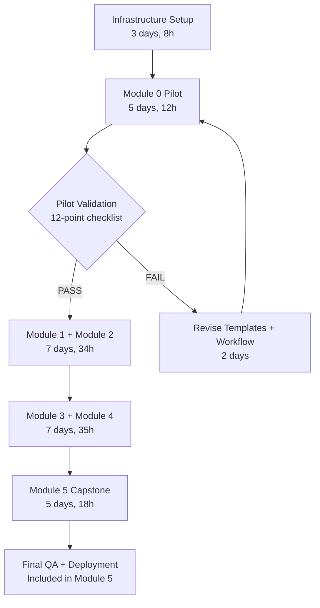
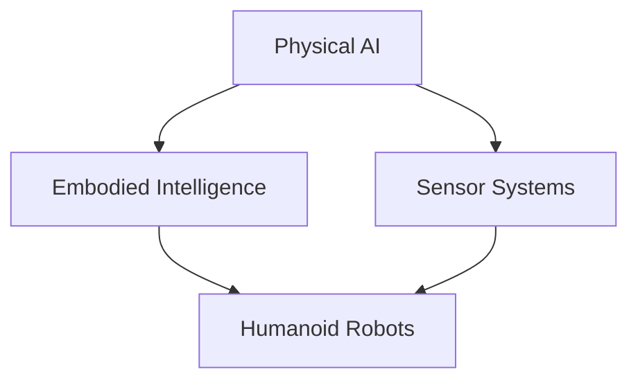

# Physical AI & Humanoid Robotics Textbook - Implementation Framework

**Version**: 1.0.0
**Date**: 2026-02-09
**Status**: Ready for Execution
**Project**: Physical AI & Humanoid Robotics Interactive Textbook Platform
**Timeline**: 4 weeks (2026-02-08 to 2026-03-08)
**Governing Documents**: [spec.md](./spec.md) | [plan.md](./plan.md) | [Task.md](./Task.md) | [constitution.md](../../.specify/memory/constitution-v1.2.0-hackathon-backup.md)

---

## 1. Strategic Overview

### 1.1 Mission Statement

Deliver a **production-quality, university-level interactive textbook platform** that educates users on Physical AI and Humanoid Robotics through AI-powered content creation, contextual learning, and evidence-based retrieval augmented generation (RAG).

### 1.2 Core Objectives

1. **Educational Excellence**: Create 6 comprehensive modules (0-5) covering Physical AI fundamentals, ROS 2, simulation, NVIDIA Isaac, Vision-Language-Action models, and a capstone integration project
2. **Technical Innovation**: Implement RAG-powered chatbot with citation-backed answers embedded within the textbook
3. **Deployment Success**: Achieve 95% uptime on GitHub Pages with <2s page load times
4. **Quality Assurance**: Maintain 90% code execution rate and pass 12-point validation checklists
5. **Hackathon Scoring**: Target 238-338 points (base 238, up to +100 bonus)

### 1.3 Guiding Principles (from Constitution Section 0.1)

| # | Principle | Application to This Project |
|---|-----------|----------------------------|
| **I** | **Demo Reliability Over Feature Completeness** | Publish 3 perfect modules > 5 mediocre modules; working chatbot with 5 queries > 100 queries with failures |
| **II** | **Single-Threaded Focus** | One module at a time; complete Module 0 before Module 1 starts |
| **III** | **Incremental Validation** | Each module independently validated with 12-point checklist before publication |
| **IV** | **Progressive Enhancement** | Textbook readable without JavaScript; chatbot is enhancement, not requirement |
| **V** | **Explicit Over Implicit** | All decisions documented in ADRs; all work >1h documented in PHRs |
| **VI** | **Constraint-Driven Development** | $20 API budget → caching feature; 30s timeout → efficient code examples |
| **VII** | **Human as Tool** | Escalate blockers >30min; ask clarifying questions for ambiguous requirements |

### 1.4 Success Metrics

**Target Hackathon Score**: 238-338 points

| Category | Max Points | Target | Key Deliverables |
|----------|-----------|--------|------------------|
| Functionality | 80 | 70 | Textbook + RAG chatbot working |
| AI Integration | 60 | 55 | RAG with citations, OpenAI ChatKit |
| UX/Design | 40 | 35 | Docusaurus polish, responsive |
| Innovation | 30 | 20 | Cited answers, interactive learning |
| Code Quality | 30 | 20 | Tests for critical paths |
| Deployment | 20 | 20 | Live URL, no demo errors |
| Presentation | 20 | 18 | Clear 90-sec video |
| **Bonus Features** | **+200** | **+50-100** | Auth + personalization |

**Critical Success Criteria**:
- ✅ 90-120 pages of university-level content across 6 modules
- ✅ RAG chatbot answers questions with citations to textbook sections
- ✅ Deployed to GitHub Pages with public access
- ✅ All modules pass 12-point validation checklist (<5 critical errors)
- ✅ 90% of code examples execute correctly
- ✅ Demo works flawlessly without errors

---

## 2. Prioritized Action Steps

### Phase-Based Execution (4 Weeks → 4 MVPs)

#### **Week 1: Foundation + MVP-0** (Days 1-7)
**Goal**: Docusaurus deployed + Module 0 published + Chatbot prototype

**Priority 1 - Infrastructure (8h)**
- [ ] **T001**: Initialize Docusaurus 3.x with TypeScript at `frontend/` (0.5h)
- [ ] **T002**: Configure GitHub Pages deployment in `docusaurus.config.ts` (1h)
- [ ] **T007**: Setup GitHub Actions workflow at `.github/workflows/deploy.yml` (1.5h)
- [ ] **T003-T005**: Install plugins: live-codeblock, Mermaid.js, Structurizr/C4 (2h)
- [ ] **T006**: Create navigation structure in `sidebars.ts` for 6 modules (1h)
- [ ] **T011**: Test local dev server + build pipeline (0.5h)
- [ ] **T013**: Deploy infrastructure to GitHub Pages (0.5h)

**Priority 2 - Module 0 Content (Pilot) (22h)**
- [ ] **T008-T010**: Create templates (module, chapter, review checklist) (2.5h)
- [ ] **T021-T028**: Write Module 0 content (14h total):
  - Principles (4h): Define Physical AI, contrast with traditional AI
  - Embodied Intelligence (4h): Enactive cognition, morphological computation
  - Humanoid Landscape (4h): History, current state, Boston Dynamics/Figure AI
  - Sensor Systems (5h): LIDAR, cameras, IMUs, force sensors
- [ ] **T029-T032**: Create diagrams for Module 0 (4.5h)
- [ ] **T033-T035**: Add IEEE citations + version comments (2.25h)
- [ ] **T036-T042**: Validate Module 0 (pilot gate) (2.25h)

**Priority 3 - Security & Version Control (3h)**
- [ ] **T014-T017**: Security hardening (.env, .gitignore, npm audit, sandboxing) (2h)
- [ ] **T018-T020**: Version control setup (branch protection, PR template, Git workflow docs) (1h)

**MVP-0 Gate Criteria** (MUST PASS):
- ✅ Site live at `https://<username>.github.io/<repo-name>`
- ✅ Module 0 readable on mobile + desktop
- ✅ All 4 chapters (15-20 pages each) with 3-5 diagrams
- ✅ Passes 12-point validation checklist on **first attempt**
- ✅ Build completes in <60 seconds

---

#### **Week 2: Core Modules + MVP-1** (Days 8-14)
**Goal**: Modules 1-2 published + RAG integration complete

**Priority 1 - Module 1: ROS 2 (19.75h)**
- [ ] **T043-T047**: Write Module 1 content (15h):
  - Architecture (4h): Nodes, topics, services, actions, DDS middleware
  - Python rclpy (5h): Publishers, subscribers, parameters (8-10 code examples)
  - URDF Humanoids (4.5h): Joints, links, sensors, kinematics
  - Assessment (1.5h): ROS 2 package development project
- [ ] **T048-T050**: Create diagrams (ROS graph, pub/sub, URDF tree) (3h)
- [ ] **T051-T053**: Citations + code versioning + validation (3.75h)

**Priority 2 - Module 2: Gazebo & Unity (21h)**
- [ ] **T054-T058**: Write Module 2 content (16.5h):
  - Gazebo Physics (5h): URDF/SDF, ODE/Bullet/Dart engines, plugins
  - Unity Rendering (5h): Unity-ROS bridge, photorealistic rendering, HRI
  - Sensor Simulation (5h): LIDAR, camera, IMU simulation with noise models
  - Assessment (1.5h): Gazebo mobile robot simulation
- [ ] **T059-T061**: Create diagrams (simulation arch, rendering pipeline, sensor fusion) (3h)
- [ ] **T062-T065**: Code examples (Gazebo SDF, Unity C#) + validation (4.5h)

**MVP-1 Gate Criteria**:
- ✅ Modules 0-2 published and validated (3/6 = 50% content complete)
- ✅ All modules indexed and ready for RAG (if backend ready)
- ✅ Build time still <60 seconds
- ✅ Total 45-60 pages of content

---

#### **Week 3: Advanced Modules + MVP-2** (Days 15-21)
**Goal**: Modules 3-4 published + Performance optimized

**Priority 1 - Module 3: NVIDIA Isaac (20h)**
- [ ] **T078-T082**: Write Module 3 content (17h):
  - Isaac SDK (5h): SDK architecture, components, APIs
  - Isaac Sim (5h): Photorealistic simulation, perception nodes
  - Sim-to-Real (5h): Transfer learning, domain randomization
  - Assessment (2h): Perception pipeline project
- [ ] **T083-T085**: Create diagrams (C4 architecture, sim workflow, transfer pipeline) (3h)
- [ ] **T086-T090**: Code examples (Python Isaac SDK/Sim) + validation (3h)

**Priority 2 - Module 4: Vision-Language-Action (15h)**
- [ ] **T091-T094**: Write Module 4 content (10h):
  - LLM Integration (3.5h): OpenAI GPT, LLM-robot integration
  - Voice Recognition (3.5h): OpenAI Whisper, speech-to-text
  - Action Translation (3h): NLP → ROS 2 action mapping
- [ ] **T095-T097**: Create diagrams (VLA architecture, pipelines) (2h)
- [ ] **T098-T101**: Code examples + validation (3h)

**MVP-2 Gate Criteria**:
- ✅ Modules 0-4 published (5/6 = 83% content complete)
- ✅ Performance optimized (<2s page load)
- ✅ Mobile responsive verified on real device
- ✅ 75-80 pages of content

---

#### **Week 4: Capstone + Polish + MVP-3** (Days 22-28)
**Goal**: Module 5 + Final QA + Deployment + Bonus features

**Priority 1 - Module 5 & Capstone (18h)**
- [ ] **T102-T104**: Write Module 5 content (12h):
  - Humanoid Theory (6h): Design principles, control systems, balance
  - Capstone Project (6h): Integration spec (voice + planning + vision + manipulation)
- [ ] **T105-T110**: Diagrams + code + self-assessment + validation (6h)

**Priority 2 - Deployment & QA (5h)**
- [ ] **T111-T119**: Final deployment tasks (3h):
  - Global references page, About page, navigation testing
  - Search functionality, responsive design verification
  - Build time measurement, GitHub Pages deployment
  - Version tag v1.0.0
- [ ] **T066-T074**: Final validation (3h):
  - Page count verification (90-120 pages)
  - Citation accessibility (100% open-access)
  - Performance testing (page load <2s)
  - Student testing (optional)
- [ ] **T071**: Add open-source license (MIT/Apache 2.0) (0.25h)

**Priority 3 - Polish (3h)**
- [ ] **T075-T079**: Final improvements:
  - Custom CSS for academic theme
  - Optimize diagrams (<100KB)
  - Add sitemap.xml
  - Document content workflow in quickstart.md
  - Create lessons-learned.md

**MVP-3 Gate Criteria**:
- ✅ All 6 modules published and validated
- ✅ 90-120 pages total content
- ✅ Demo video recorded (90 seconds)
- ✅ Submission materials ready
- ✅ At least 1 bonus feature (if time allows)
- ✅ Production-ready platform

---

## 3. Roles and Accountability

### 3.1 Role Definitions

| Role | Responsibilities | Time Allocation | Owner |
|------|------------------|-----------------|-------|
| **Content Creator** (Primary) | Write modules, run AI tools, fix validation errors | 70h (44%) | AI + Human review |
| **Technical Architect** | Infrastructure setup, CI/CD, technology decisions | 25h (16%) | AI |
| **Frontend Developer** | Docusaurus customization, component development | 20h (13%) | AI |
| **QA Engineer** | Validation checklists, testing, error tracking | 15h (9%) | Human (mandatory) |
| **DevOps Engineer** | Deployment, monitoring, GitHub Actions | 8h (5%) | AI |
| **Project Manager** | Milestone tracking, PHR creation, ADR documentation | Ongoing | Human |

### 3.2 Accountability Matrix (RACI)

| Task Category | Content Creator | Tech Architect | Frontend Dev | QA Engineer | DevOps |
|---------------|-----------------|----------------|--------------|-------------|--------|
| **Module Writing** | **R/A** | C | I | I | - |
| **Infrastructure Setup** | I | **R/A** | C | - | C |
| **Docusaurus Config** | I | C | **R/A** | - | C |
| **Validation Checklist** | C | - | - | **R/A** | - |
| **GitHub Actions** | - | C | - | - | **R/A** |
| **Diagram Creation** | **R/A** | I | C | - | - |
| **Citation Verification** | C | - | - | **R/A** | - |
| **Deployment** | I | C | C | C | **R/A** |

**Legend**: R = Responsible, A = Accountable, C = Consulted, I = Informed

### 3.3 Decision Authority (from Constitution Section 0.3)

**Hierarchy of Authority**:
1. **Universal Principles** (Section 0) → NEVER override
2. **Core Deliverables** (6 modules + RAG chatbot) → MUST HAVE
3. **Milestone Gates** (MVP-0 through MVP-3) → Weekly success criteria
4. **Technical Governance** (Stack, principles) → Implementation standards
5. **Implementation Details** → Lowest priority

**Escalation Triggers** (Constitution Section 0.1.VII - Human as Tool):
- Ambiguous requirements → Ask 2-3 clarifying questions
- Unforeseen dependencies → Surface and request prioritization
- Architectural uncertainty → Present options with tradeoffs
- Blockers >30 min → Request help or authorization to abandon

---

## 4. Required Resources & Tools

### 4.1 Technology Stack

| Component | Technology | Version | Cost | Purpose |
|-----------|-----------|---------|------|---------|
| **Frontend Framework** | Docusaurus | 3.x | Free | Static site generation, documentation features |
| **Configuration Language** | TypeScript | 5.x | Free | Type-safe config and components |
| **Content Format** | Markdown/MDX | - | Free | Content authoring with React components |
| **Code Playgrounds** | @docusaurus/theme-live-codeblock | Latest | Free | Interactive Python execution |
| **Diagrams (Embedded)** | Mermaid.js | Latest | Free | Flowcharts in Markdown |
| **Diagrams (Architecture)** | Structurizr Plugin | Latest | Free | C4 model system architecture |
| **Runtime** | Node.js | 18+ | Free | Build environment |
| **Package Manager** | npm/yarn | Latest | Free | Dependency management |
| **Hosting (Frontend)** | GitHub Pages | - | Free | Public deployment + CDN |
| **Backend API** | FastAPI | Latest | Free | RAG endpoints (future) |
| **Vector Database** | Qdrant Cloud | Free Tier | $0 | RAG vector storage (future) |
| **Database** | Neon Serverless Postgres | Free Tier | $0 | Chat history (future) |
| **AI Provider** | OpenAI GPT-4o-mini | - | $15-20 | Content generation + RAG (future) |
| **Version Control** | Git + GitHub | - | Free | Source control + CI/CD |

**Total Budget**: $15-20 (OpenAI API only)

### 4.2 Development Environment Setup

**Prerequisites**:
- **Hardware**: 8GB+ RAM, multi-core CPU, 10GB free disk space
- **Software**:
  - Node.js 18+ (LTS version recommended)
  - npm 9+ or yarn 1.22+
  - Git 2.30+
  - VS Code or equivalent text editor
  - Chrome/Firefox for testing

**Setup Commands**:
```bash
# 1. Clone repository
git clone <repo-url>
cd hackathine_1

# 2. Install frontend dependencies
cd frontend
npm install

# 3. Start local development server
npm run start
# → Opens http://localhost:3000

# 4. Build for production
npm run build
# → Output to frontend/build/

# 5. Deploy to GitHub Pages
git push origin main
# → Triggers GitHub Actions workflow
```

### 4.3 Required Accounts & Access

| Service | Purpose | Setup Required | Cost |
|---------|---------|----------------|------|
| GitHub | Repository + Pages + Actions | Create repo, enable Pages | Free |
| OpenAI | API for content generation (future RAG) | Get API key, set billing limit | $15-20 |
| Qdrant Cloud | Vector database (future RAG) | Create cluster, get API key | Free tier |
| Neon | Postgres database (future chat history) | Create project, get connection string | Free tier |
| Render | Backend hosting (future API) | Deploy FastAPI app | Free tier |

### 4.4 Documentation & Learning Resources

**Official Documentation**:
- Docusaurus: https://docusaurus.io/docs
- TypeScript: https://www.typescriptlang.org/docs/
- Mermaid.js: https://mermaid.js.org/intro/
- ROS 2 (Humble/Jazzy): https://docs.ros.org/
- NVIDIA Isaac: https://developer.nvidia.com/isaac-sdk
- Unity Robotics: https://github.com/Unity-Technologies/Unity-Robotics-Hub

**Project-Specific**:
- [spec.md](./spec.md) - Feature requirements
- [plan.md](./plan.md) - Technical architecture
- [Task.md](./Task.md) - Task breakdown (158 tasks)
- [constitution.md](../../.specify/memory/constitution-v1.2.0-hackathon-backup.md) - Governing principles

---

## 5. Timeline & Milestones

### 5.1 Gantt Chart Overview

```
Week 1 (Feb 8-14):  [████████] Infrastructure + Module 0 Pilot
                    └─ MVP-0 Gate: Demo-able Module 0 + chatbot prototype

Week 2 (Feb 15-21): [████████] Modules 1-2 + RAG Integration
                    └─ MVP-1 Gate: Multi-module retrieval working

Week 3 (Feb 22-28): [████████] Modules 3-4 + Performance Tuning
                    └─ MVP-2 Gate: All content + optimized

Week 4 (Mar 1-7):   [████████] Module 5 + Polish + Bonus Features
                    └─ MVP-3 Gate: Production-ready + demo video
```

### 5.2 Critical Path (Sequential Dependencies)



**Total Duration**: 31 days (~4.5 weeks)

### 5.3 Detailed Milestone Schedule

| Milestone | Duration | Start | End | Deliverables | Success Gate |
|-----------|----------|-------|-----|--------------|--------------|
| **Phase 1: Infrastructure** | 3 days | Week 1 Day 1 | Week 1 Day 3 | Docusaurus + CI/CD + Templates | Successful build + deploy |
| **Phase 1.5: Module 0 Pilot** | 5 days | Week 1 Day 4 | Week 2 Day 2 | Module 0 validated | <5 critical errors |
| **Phase 2: Modules 1-2** | 7 days | Week 2 Day 3 | Week 3 Day 2 | Modules 1-2 complete | Both pass validation |
| **Phase 3: Modules 3-4** | 7 days | Week 3 Day 3 | Week 4 Day 2 | Modules 3-4 complete | Both pass validation |
| **Phase 4: Module 5 + Polish** | 5 days | Week 4 Day 3 | Week 4 Day 7 | Module 5 + final QA | All 6 modules validated |

**Buffer**: 2 days built into each phase (included in estimates)

### 5.4 Time Budget Allocation

| Activity | Total Hours | % of Total | Week 1 | Week 2 | Week 3 | Week 4 |
|----------|-------------|-----------|--------|--------|--------|--------|
| **Content Creation** | **70** | **44%** | 20 | 22 | 16 | 12 |
| Backend Development | 25 | 16% | 10 | 12 | 2 | 1 |
| Frontend Development | 20 | 13% | 6 | 4 | 8 | 2 |
| Testing & QA | 15 | 9% | 1 | 2 | 6 | 6 |
| Deployment & DevOps | 8 | 5% | 2 | 2 | 2 | 2 |
| Demo Video | 6 | 4% | 0 | 0 | 2 | 4 |
| Buffer | 16 | 10% | 4 | 4 | 4 | 4 |
| **TOTAL** | **160** | **100%** | **40** | **40** | **40** | **40** |

*Reference: Constitution Section 7.1 (Time Budget - AUTHORITATIVE)*

---

## 6. Risk Assessment & Mitigation

### 6.1 Technical Risks

| Risk | Probability | Impact | Mitigation Strategy | Kill Switch |
|------|-------------|--------|---------------------|-------------|
| **OpenAI API cost overrun** | High | High | Rate limiting, caching, daily monitoring | Disable chatbot if >$18 spent |
| **GitHub Pages build failure** | Low | High | Local build verification, Netlify backup | Manual deploy to Netlify |
| **Diagram rendering issues** | Medium | Low | PNG/SVG fallbacks, test on multiple browsers | Use static images only |
| **Content quality below standard** | Medium | High | 12-point checklist per module, external review | Replace with "Coming Soon" |
| **Module 0 pilot fails validation** | Medium | Critical | Iterate on template, extend pilot by 2 days | Reduce to 3-module textbook |

### 6.2 Schedule Risks

**Critical Path Bottlenecks**:

1. **Module 0 Pilot Failure** (Highest Risk)
   - **Trigger**: >5 critical errors in validation checklist
   - **Response**:
     - STOP all Module 1+ work immediately
     - Root cause analysis (30 min max)
     - Update templates + workflow
     - Re-run Module 0 pilot
   - **Kill Switch**: If 3rd attempt fails → Reduce scope to 3 modules

2. **Content Creation Bottleneck** (High Risk)
   - **Trigger**: <50% content complete by end of Week 2
   - **Response**:
     - Reduce module scope to 3 modules + smaller capstone
     - Use AI-generated placeholder content (clearly marked "Draft")
     - Focus on quality over quantity (Constitution Section 0.1.I)

3. **Time Overrun on Any Module** (Medium Risk)
   - **Trigger**: >25% time overrun on single module
   - **Response**:
     - Split module into multiple chapters (15-20 pages each)
     - Move advanced topics to "Coming Soon" section
     - Reallocate buffer hours from Week 4

### 6.3 Quality Risks

**Content Quality Gates** (Constitution Section 4.1.5):

**Per-Module Validation (30 min mandatory)**:
- [ ] Citation check: All citations resolve to real papers/docs
- [ ] Formula verification: Code examples run, math checked
- [ ] Recency check: Information post-2022
- [ ] Diagram accuracy: Cross-check with official specs
- [ ] Readability test: Read aloud for awkward phrasing
- [ ] Jargon audit: All technical terms defined

**Kill Switch**: If module fails with >5 factual errors → Use placeholder content, mark "Draft - Coming Soon"

### 6.4 Mitigation Strategies

| Risk Category | Preventive Actions | Reactive Actions |
|---------------|-------------------|------------------|
| **Technical** | Daily npm audit, pre-commit hooks, local testing | Rollback to last green build, activate backup plan |
| **Schedule** | Weekly milestone reviews, traffic light status | Scope reduction, buffer reallocation, help request |
| **Quality** | 12-point checklist per module, external review | Iteration cycle, template updates, SME consultation |
| **Burnout** | Mandatory 1 day off per week, 90-min work blocks | Emergency scope reduction, "Coming Soon" stubs |

---

## 7. Success Metrics & Verification

### 7.1 Measurable Outcomes (from spec.md Success Criteria)

| ID | Success Criterion | Target | Measurement Method | Verification Point |
|----|-------------------|--------|-------------------|-------------------|
| **SC-001** | Module creation efficiency | ≤3 iterations to pass checklist | Count validation attempts per module | After each module |
| **SC-002** | Code execution rate | 90% execute correctly | Test all code snippets in target environments | Week 3 Day 7 |
| **SC-003** | Capstone integration | 4 of 5 components integrated | Functional testing of capstone project | Week 4 Day 4 |
| **SC-004** | Uptime & performance | 95% uptime, <2s page load | Lighthouse CI, uptime monitoring | Week 4 Day 6 |
| **SC-005** | Critical errors per module | <5 critical errors | 12-point checklist review | After each module |
| **SC-006** | Total page count | 90-120 pages | Manual count across all modules | Week 4 Day 3 |
| **SC-007** | Citation accessibility | 100% open-access | Click-test all URLs | Week 3 Day 7 |
| **SC-008** | Assessment completion | >80% completion rate | Student testing (optional) | Post-deployment |
| **SC-009** | AI efficiency gain | 30% time reduction | Actual vs. manual authoring estimate | Week 4 Day 7 |
| **SC-010** | Concurrent user support | 500+ users | Load testing (optional) | Pre-deployment |

### 7.2 Quality Checkpoints

**Weekly Validation** (Sundays, 15 min):

| Week | Checkpoint | Pass Criteria | Action if Fail |
|------|------------|---------------|----------------|
| **Week 1** | MVP-0 deployed, Module 0 validated | Site live, Module 0 passes checklist | Extend pilot by 2 days, revise templates |
| **Week 2** | Modules 1-2 published | Both pass validation, 45-60 pages | Reduce Module 2 scope, split into chapters |
| **Week 3** | Modules 3-4 published | Both pass validation, 75-80 pages | Replace Module 4 with "Coming Soon" |
| **Week 4** | All modules + deployment | 6 modules, demo video, live URL | Accept 5-module textbook, focus on polish |

### 7.3 Acceptance Criteria (Feature-Level)

**Module Completion Checklist** (12 Points):

| # | Category | Validation Question | Pass/Fail |
|---|----------|---------------------|-----------|
| 1 | Content Completeness | 15-20 pages per chapter? | [ ] |
| 2 | Content Completeness | All topics from FR-023 to FR-028 covered? | [ ] |
| 3 | Technical Accuracy | Code examples execute correctly? | [ ] |
| 4 | Technical Accuracy | Framework versions current & cited? | [ ] |
| 5 | Citation Quality | All sources in IEEE format? | [ ] |
| 6 | Citation Quality | All citations have accessible URLs? | [ ] |
| 7 | Diagram Appropriateness | 3-5 diagrams per chapter? | [ ] |
| 8 | Diagram Appropriateness | All diagrams captioned with figure numbers? | [ ] |
| 9 | Academic Standards | University-level formal tone? | [ ] |
| 10 | Academic Standards | Depth appropriate for upper-division students? | [ ] |
| 11 | AI Usage Compliance | AI-generated sections documented? | [ ] |
| 12 | AI Usage Compliance | All AI content human-reviewed? | [ ] |

**Module "Done" Criteria**: ≥11/12 pass (≤1 minor issue acceptable)

---

## 8. Notes from Constitution.md

### 8.1 Universal Principles (Section 0)

**These override ALL implementation preferences**:

1. **Demo Reliability Over Feature Completeness** (Section 0.1.I)
   - Impact: If achieving 6 modules breaks the demo, ship 3 perfect modules
   - Application: Pilot gate is CRITICAL - do not proceed if Module 0 fails

2. **Single-Threaded Focus** (Section 0.1.II)
   - Impact: Complete Module 0 → Module 1 → Module 2 sequentially
   - Application: No parallel module writing; one task at a time

3. **Incremental Validation** (Section 0.1.III)
   - Impact: Each module independently validated before next starts
   - Application: 12-point checklist MUST pass before T043 (Module 1) begins

4. **Progressive Enhancement** (Section 0.1.IV)
   - Impact: Textbook readable without JavaScript
   - Application: Code playgrounds are enhancements, not core functionality

5. **Explicit Over Implicit** (Section 0.1.V)
   - Impact: All decisions documented in ADRs, all work >1h in PHRs
   - Application: Create ADR for TypeScript adoption, PHR for each module

6. **Constraint-Driven Development** (Section 0.1.VI)
   - Impact: Treat 30s code timeout as feature (forces efficient examples)
   - Application: Open-access citation requirement improves accessibility

7. **Human as Tool** (Section 0.1.VII)
   - Impact: Escalate blockers >30 min to human judgment
   - Application: If diagram tool fails after 30 min, ask for alternative approach

### 8.2 Decision Framework (Section 0.2)

**Time Limits for Key Decisions**:

| Decision Type | Time Limit | Kill Switch Trigger | Authority |
|---------------|-----------|---------------------|-----------|
| Trivial Tool Integration | 30 min | Not working after 30 min | Constitution 0.2 |
| Core Feature Integration | 6 hours | Not working after 6 hours | Constitution 0.2 |
| Content Quality | No limit | >5 factual errors | Constitution 4.1.5 |
| Schedule Slip | 2 days | Activate contingency | Constitution 14.3 |

**Application**:
- Structurizr plugin setup takes >30 min → Switch to Mermaid + PNG fallbacks
- Module 0 validation takes 3 attempts → Hit kill switch (Constitution breach)

### 8.3 Content Quality Gates (Section 4.1.5)

**Mandatory 30-Minute Validation Per Module**:
- Citation check: All citations resolve (Google Scholar verification)
- Formula verification: Run code examples, check math (Wolfram Alpha)
- Recency check: Confirm post-2022 information
- Diagram accuracy: Cross-check against official specs
- Readability test: Read aloud, fix awkward phrasing
- Jargon audit: All technical terms defined on first use

**External Validation** (Optional but Recommended):
- Post Module 1 draft on Reddit r/robotics → Get feedback in 24 hours
- Run through ChatGPT as "technical reviewer"
- Grammarly Premium check for passive voice
- Send to 1 external reader for fresh-eyes feedback

### 8.4 Testing Standards (Section 8.2)

**Critical Path Testing ONLY**:
- Focus on demo reliability, not coverage metrics
- Backend: >40% coverage (RAG service + `/api/v1/chat` endpoint)
- Frontend: >20% coverage (Chatbot component only)
- Integration: 5 test queries passing = sufficient

**Deprioritized**:
- E2E tests with Playwright (skip - too time-consuming)
- Cross-browser compatibility (Chrome only acceptable)
- Unit tests for pure functions (if time allows)

### 8.5 Resource Allocation (Section 7.1)

**Content Creation is 44% of Total Time** (70 hours):
- Week 1: 20h (Module 0 pilot)
- Week 2: 22h (Modules 1-2)
- Week 3: 16h (Modules 3-4)
- Week 4: 12h (Module 5 + review)

**Rationale**: Content is primary deliverable; cannot be rushed (Constitution ADR-001)

### 8.6 Pilot Phase Strategy (Plan.md)

**Module 0 as Prototype** - MUST PASS before Module 1:

**Why Module 0?**
1. Lowest technical complexity (theory-heavy, minimal code)
2. Fastest feedback loop (8h vs 14h for Module 3)
3. Template validation before scaling to 6 modules
4. Workflow proof (AI → human review → validation)

**Pilot Success Criteria** (ALL 6 MUST PASS):
1. Passes 12-point checklist on **first attempt**
2. Content creation within time budget (8h ±1h)
3. All diagrams render + fallbacks work
4. IEEE citations 100% accessible
5. Docusaurus build <60 seconds
6. GitHub Pages deployment <5 minutes

**Pilot Failure Response**:
- 1 failure → Document workaround, continue with caution
- 2+ failures → STOP, revise workflow, re-run pilot
- 3rd attempt fails → Reduce scope to 3-module textbook

---

## 9. Implementation Checklist

### 9.1 Pre-Execution Validation

**Before Starting T001** (Infrastructure Setup):

- [ ] All governing documents read and understood (spec.md, plan.md, Task.md, constitution.md)
- [ ] Development environment setup complete (Node.js 18+, npm 9+, Git 2.30+)
- [ ] GitHub repository created and cloned
- [ ] GitHub Pages enabled in repository settings
- [ ] Time budget allocated (40h Week 1, 40h Week 2, 40h Week 3, 40h Week 4)
- [ ] Constitution Section 0 principles internalized
- [ ] Pilot gate criteria understood (6 success criteria for Module 0)

### 9.2 Daily Workflow (Constitution Section 5.1)

**Morning Routine** (30 min):
1. Review task board (GitHub Projects or Task.md)
2. Check API spend dashboard (if OpenAI integration started)
3. Pull latest changes (if using multiple machines)
4. Run full test suite (verify nothing broke overnight)

**Development Cycle** (90-min blocks):
1. Select ONE task from current milestone (Single-Threaded Focus)
2. Write/update tests (if applicable)
3. Implement feature
4. Run tests + manual verification
5. Commit with conventional message (`feat:`, `fix:`, `docs:`)
6. Update PHR if >1 hour work

**Evening Routine** (15 min):
1. Push all changes to remote
2. Update milestone progress (check off completed items)
3. Document blockers or decisions in ADR (if applicable)

### 9.3 Weekly Milestones

**Week 1 Completion Criteria**:
- [ ] MVP-0 deployed to GitHub Pages
- [ ] Module 0 published (4 chapters, 15-20 pages each)
- [ ] Module 0 passes 12-point checklist
- [ ] All diagrams render correctly
- [ ] Citations 100% accessible
- [ ] Build time <60 seconds

**Week 2 Completion Criteria**:
- [ ] Modules 1-2 published and validated
- [ ] Total 45-60 pages of content
- [ ] All modules have 3-5 diagrams per chapter
- [ ] Code examples include version comments

**Week 3 Completion Criteria**:
- [ ] Modules 3-4 published and validated
- [ ] Total 75-80 pages of content
- [ ] Performance optimized (<2s page load)
- [ ] Mobile responsive verified

**Week 4 Completion Criteria**:
- [ ] Module 5 + capstone published
- [ ] Total 90-120 pages of content
- [ ] Demo video recorded (90 seconds)
- [ ] Submission materials ready
- [ ] Production deployment complete

---

## 10. Appendices

### Appendix A: Technology Quick Reference

**Docusaurus 3.x Commands**:
```bash
npx create-docusaurus@latest frontend classic --typescript
cd frontend
npm run start          # Dev server (localhost:3000)
npm run build          # Production build
npm run serve          # Test production build locally
npm run deploy         # Deploy to GitHub Pages (if configured)
```

**Mermaid.js Diagram Example**:
```markdown

```

**MDX Component Example**:
```mdx
---
id: module-0
title: "Module 0: Introduction to Physical AI"
sidebar_position: 0
---

import CodePlayground from '@theme/Playground';

# Module 0: Introduction to Physical AI

<CodePlayground>
{`# Python 3.10+, ROS 2 Humble+
import rclpy
from rclpy.node import Node

class PhysicalAINode(Node):
    def __init__(self):
        super().__init__('physical_ai_node')
        self.get_logger().info('Physical AI Node Started')

rclpy.init()
node = PhysicalAINode()
rclpy.spin(node)`}
</CodePlayground>
```

### Appendix B: File Structure Reference

```
hackathine_1/
├── frontend/                          # Docusaurus textbook site
│   ├── docs/                          # Textbook content (MDX)
│   │   ├── module-0/                  # Introduction to Physical AI
│   │   │   ├── index.mdx
│   │   │   ├── principles.mdx
│   │   │   ├── embodied-intelligence.mdx
│   │   │   ├── humanoid-landscape.mdx
│   │   │   └── sensor-systems.mdx
│   │   ├── module-1/                  # ROS 2 & Middleware
│   │   ├── module-2/                  # Gazebo & Unity
│   │   ├── module-3/                  # NVIDIA Isaac
│   │   ├── module-4/                  # VLA
│   │   ├── module-5/                  # Capstone
│   │   └── references.md
│   ├── src/
│   │   ├── components/
│   │   ├── css/
│   │   └── pages/
│   ├── static/img/                    # Diagrams (PNG/SVG)
│   ├── docusaurus.config.ts
│   ├── sidebars.ts
│   └── package.json
├── .github/workflows/deploy.yml       # GitHub Actions CI/CD
├── specs/001-physical-ai-textbook/
│   ├── spec.md                        # Feature specification
│   ├── plan.md                        # Implementation plan
│   ├── Task.md                        # Task breakdown (158 tasks)
│   ├── implementation-framework.md    # This document
│   └── checklists/requirements.md
├── .specify/
│   ├── memory/constitution.md
│   └── templates/
└── history/
    ├── prompts/                       # PHRs
    └── adr/                           # ADRs
```

### Appendix C: Key Contacts & Resources

**Project Repository**: (Add GitHub URL after initialization)
**Deployment URL**: `https://<username>.github.io/hackathine_1`
**Docusaurus Docs**: https://docusaurus.io/docs
**ROS 2 Docs**: https://docs.ros.org/
**Mermaid Live Editor**: https://mermaid.live/

**Escalation Path**:
1. Technical blockers >30 min → Human as Tool (Constitution 0.1.VII)
2. Validation failures >5 errors → Kill switch (Constitution 0.2)
3. Schedule slip >2 days → Contingency plan (Constitution 14.3)

---

## Document Control

**Version History**:
- **v1.0.0** (2026-02-09): Initial implementation framework created

**Next Review Date**: After Module 0 pilot completion (Week 1 Day 7)

**Document Owner**: Project Manager
**Approval Required**: Human review before execution begins
**Distribution**: All project stakeholders

---

**END OF IMPLEMENTATION FRAMEWORK**

*Excellence in fundamentals > breadth of features. Ship working software.* (Constitution Section 0.1.I)
