# Implementation Plan: Physical AI & Humanoid Robotics Educational Textbook

**Branch**: `001-physical-ai-textbook` | **Date**: 2026-02-09 | **Spec**: [spec.md](./spec.md)
**Input**: Feature specification from `/specs/001-physical-ai-textbook/spec.md`

## Summary

Create a university-level educational textbook on Physical AI & Humanoid Robotics, implemented as a static website using Docusaurus 3.x with TypeScript, featuring interactive code playgrounds, comprehensive diagrams, and AI-assisted content creation. The textbook comprises 6 modules (Module 0-5) with sequential learning progression, deployed to GitHub Pages with automated CI/CD. Content will be created using Spec-Kit Plus and Claude Code, following strict academic standards with IEEE-style citations, 3-5 diagrams per chapter, and mandatory human review of all AI-generated content.

**Core Deliverable**: A production-ready textbook with 90-120 pages (15-20 pages per chapter) covering Physical AI principles, ROS 2, simulation (Gazebo/Unity), NVIDIA Isaac SDK, Vision-Language-Action models, and a capstone integration project, with all content validated against a 12-point review checklist.

## Technical Context

**Language/Version**: TypeScript 5.x (infrastructure), Python 3.x (code examples), Markdown/MDX (content)
**Primary Dependencies**: Docusaurus 3.x, @docusaurus/theme-live-codeblock, Mermaid.js, Node.js 18+
**Storage**: Git repository (version control), Static files (GitHub Pages hosting)
**Testing**: Manual validation checklist (12 criteria per module), Code example execution tests
**Target Platform**: Web browsers (desktop, tablet, mobile) - responsive design
**Project Type**: Static site generation (SSG) + content authoring workflow
**Performance Goals**: <2s page load time, 95% uptime, 500 concurrent users, 30s code playground timeout
**Constraints**: Open-access citations only, 15-20 pages per chapter, 3-5 diagrams per chapter, IEEE citation format
**Scale/Scope**: 6 modules, 90-120 total pages, minimum 3 citations per module, 1 code snippet per module

## Constitution Check

*GATE: Must pass before Phase 0 research. Re-check after Phase 1 design.*

### Universal Principles Alignment (Section 0.1)

✅ **I. Demo Reliability Over Feature Completeness**: Plan focuses on delivering complete modules sequentially rather than partial content across all modules. Module 0-2 completion prioritized over having all 6 modules at 50%.

✅ **II. Single-Threaded Focus**: Content creation follows single-author sequential workflow (FR-046). One module completed before starting next.

✅ **III. Incremental Validation**: Each module validated independently using 12-point checklist before publication (FR-029, Section 4.1.5).

✅ **IV. Progressive Enhancement**: Textbook readable without JavaScript (Docusaurus SSG). Interactive features (code playgrounds) are enhancements, not requirements for core reading.

✅ **V. Explicit Over Implicit**: All framework choices documented (FR-049 through FR-055), review checklist defined (FR-029), edge cases resolved with concrete strategies.

✅ **VI. Constraint-Driven Development**: Open-access citation requirement (SC-007) forces discovery of high-quality free resources, improving accessibility. 30-second timeout (FR-051) forces efficient code examples.

✅ **VII. Human as Tool**: Mandatory human review of AI-generated content (FR-011), version validation, citation accessibility verification.

### Constitution-Specific Requirements

✅ **Content Quality Gates (Section 4.1.5)**: 30-minute validation per module mandatory, kill switch at >5 factual errors
✅ **Testing Standards (Section 8.2)**: Focus on critical path (module review checklist, code example execution)
✅ **Time Budget Alignment (Section 7.1)**: Content creation is 44% of project time (70 hours) - aligns with primary deliverable
⚠️ **NOTE**: This is a **content creation project**, not a software development project. The constitution is written for the broader hackathon platform (Docusaurus site + RAG chatbot). This plan focuses ONLY on the textbook content and Docusaurus infrastructure per the specification.

### Gate Evaluation

**Status**: ✅ **PASS** - No violations requiring justification

All requirements align with constitution principles. Content-first approach matches Section 7.1 time budget (44% content creation). Sequential module workflow implements Single-Threaded Focus. Incremental validation prevents "90% complete" trap.

## Project Structure

### Documentation (this feature)

```text
specs/001-physical-ai-textbook/
├── spec.md                         # Feature specification (complete)
├── plan.md                         # This file (/sp.plan command output)
├── research.md                     # Phase 0 output (technology decisions, best practices)
├── data-model.md                   # Phase 1 output (content entities, metadata structure)
├── quickstart.md                   # Phase 1 output (Docusaurus setup, content authoring guide)
├── contracts/                      # Phase 1 output (module templates, checklist formats)
│   ├── module-template.mdx        # Standardized module structure
│   ├── chapter-template.mdx       # Chapter section template (Intro→Theory→Examples→Summary)
│   └── review-checklist.md        # 12-point validation checklist
└── tasks.md                        # Phase 2 output (/sp.tasks command - NOT created by /sp.plan)
```

### Source Code (repository root)

**Structure Decision**: Web application (Docusaurus static site) with content-first organization

```text
frontend/                           # Docusaurus textbook site
├── docs/                           # Textbook content (MDX files)
│   ├── module-0/                  # Introduction to Physical AI
│   │   ├── index.mdx              # Module overview
│   │   ├── principles.mdx         # Physical AI principles
│   │   ├── embodied-intelligence.mdx
│   │   ├── humanoid-landscape.mdx
│   │   └── sensor-systems.mdx
│   ├── module-1/                  # ROS 2 & Robotics Middleware
│   │   ├── index.mdx
│   │   ├── architecture.mdx
│   │   ├── python-rclpy.mdx
│   │   ├── urdf-humanoids.mdx
│   │   └── assessment.mdx         # ROS 2 package development assessment
│   ├── module-2/                  # Gazebo & Unity Simulation
│   │   ├── index.mdx
│   │   ├── gazebo-physics.mdx
│   │   ├── unity-rendering.mdx
│   │   ├── sensor-simulation.mdx
│   │   └── assessment.mdx         # Gazebo simulation assessment
│   ├── module-3/                  # NVIDIA Isaac SDK
│   │   ├── index.mdx
│   │   ├── isaac-sdk.mdx
│   │   ├── isaac-sim.mdx
│   │   ├── sim-to-real.mdx
│   │   └── assessment.mdx         # Perception pipeline assessment
│   ├── module-4/                  # Vision-Language-Action (VLA)
│   │   ├── index.mdx
│   │   ├── llm-integration.mdx
│   │   ├── voice-recognition.mdx
│   │   └── action-translation.mdx
│   ├── module-5/                  # Humanoid Development & Capstone
│   │   ├── index.mdx
│   │   ├── humanoid-theory.mdx
│   │   └── capstone-project.mdx   # Integration capstone
│   └── references.md              # Global references (IEEE format)
├── src/
│   ├── components/
│   │   ├── DiagramViewer.tsx      # Mermaid/Structurizr diagram renderer
│   │   ├── CodePlayground.tsx     # Live code execution wrapper
│   │   └── CitationLink.tsx       # IEEE citation formatter
│   ├── css/
│   │   └── custom.css             # Docusaurus theme customization
│   └── pages/
│       ├── index.tsx              # Landing page
│       └── about.tsx              # About the textbook
├── static/
│   ├── img/                       # Diagrams (PNG/SVG exports)
│   └── examples/                  # Downloadable code examples
├── docusaurus.config.ts           # Docusaurus configuration (TypeScript)
├── sidebars.ts                    # Navigation structure
├── package.json
├── tsconfig.json
└── README.md

.github/
└── workflows/
    └── deploy.yml                 # GitHub Actions CI/CD for GitHub Pages

.specify/
├── memory/
│   └── constitution.md            # Project principles (existing)
├── templates/
│   ├── module-template.mdx        # Content templates
│   ├── chapter-template.mdx
│   └── review-checklist.md
└── scripts/
    └── bash/
        ├── create-phr.sh          # Prompt History Records (existing)
        └── validate-module.sh     # Module validation script (to be created)

history/
├── prompts/
│   └── 001-physical-ai-textbook/  # PHRs for this feature
└── adr/
    └── 001-docusaurus-typescript.md  # ADR documenting TypeScript adoption
```

**Rationale**:
- **Content-first structure**: `/docs/` organized by module for clear learning progression
- **Component isolation**: Custom React components in `/src/components/` for reusability
- **Static assets**: `/static/img/` for optimized diagram delivery (<100KB per image per constitution)
- **Type safety**: `.ts` extensions for Docusaurus config per FR-049
- **CI/CD automation**: `.github/workflows/` for deployment per FR-055

## Complexity Tracking

> **Not applicable** - No constitution violations requiring justification

**Simplicity Decisions**:
- **No custom backend**: Static site only (GitHub Pages), no API server needed
- **No database**: Content stored as MDX files in Git (version control built-in)
- **No authentication**: Public access only (FR-020), no user management complexity
- **Minimal custom components**: Docusaurus plugins handle most features (@docusaurus/theme-live-codeblock, mermaid plugin)
- **Standard tooling**: npm/yarn, Node.js 18+, GitHub Actions (no custom build tools)

**Alignment with Constitution Section 0.1.IV (Progressive Enhancement)**:
- Core content readable without JavaScript (Docusaurus SSG)
- Code playgrounds are optional enhancements (FR-050)
- Diagrams have PNG/SVG fallbacks if Mermaid fails to render

## Phase 0: Research & Technology Validation

### Research Questions (to be answered in research.md)

1. **Docusaurus 3.x Setup**:
   - What is the recommended project initialization command for Docusaurus 3.x with TypeScript?
   - How to configure `docusaurus.config.ts` for GitHub Pages deployment?
   - What plugins are required for Mermaid diagram rendering?

2. **Interactive Code Playgrounds**:
   - How to configure `@docusaurus/theme-live-codeblock` for Python code execution?
   - What are the security implications of browser-based code execution?
   - How to implement 30-second timeout per FR-051?

3. **Diagram Tooling**:
   - How to integrate Structurizr plugin for C4 architecture diagrams?
   - How to integrate draw.io plugin for complex robotics illustrations?
   - What is the export workflow for PNG/SVG fallbacks?

4. **TypeScript Migration**:
   - How to convert `docusaurus.config.js` to `docusaurus.config.ts`?
   - What type definitions are needed for custom Docusaurus plugins?

5. **Content Authoring Workflow**:
   - What is the recommended MDX frontmatter structure for module metadata?
   - How to implement IEEE citation formatting in Docusaurus?
   - What tools exist for validating Markdown/MDX syntax?

6. **GitHub Actions CI/CD**:
   - What is the recommended GitHub Actions workflow for Docusaurus deployment?
   - How to configure `CNAME` for custom domain (if needed)?
   - How to handle build errors in CI (fail fast vs. continue)?

### Research Outputs (to be documented in research.md)

**For each question**:
- **Decision**: What was chosen
- **Rationale**: Why chosen (alignment with FR requirements)
- **Alternatives Considered**: What else was evaluated
- **Best Practices**: Industry standards (from Docusaurus docs, TypeScript handbook)
- **Implementation Notes**: Specific configuration examples

## Phase 1: Design & Contracts

### 1. Data Model (data-model.md)

**Entities** (from spec.md Key Entities section):

- **Module**: Represents major learning unit (0-5)
  - Attributes: `moduleNumber`, `title`, `duration` (weeks), `focusDescription`, `topics[]`, `assessmentType`
  - Metadata: `learningOutcomes[]`, `prerequisites[]`, `estimatedPageCount`
  - File mapping: `docs/module-{N}/index.mdx`

- **Chapter**: Subdivision within module
  - Attributes: `chapterTitle`, `parentModule`, `sectionStructure` (Intro/Theory/Examples/Summary), `pageCount`, `diagramCount`, `completionStatus`
  - Metadata: `author`, `lastModified`, `aiAssisted` (boolean), `reviewStatus`
  - File mapping: `docs/module-{N}/{chapter-slug}.mdx`

- **Content Section**: Structured portion of chapter
  - Attributes: `sectionType` (Introduction/Theory/Examples/Summary), `contentText`, `codeExamples[]`, `diagrams[]`, `citations[]`
  - Metadata: `aiGenerationMetadata` (tool, prompt, humanModifications)

- **Visual Element**: Diagrams, charts, code snippets
  - Attributes: `figureNumber`, `caption`, `fileReference`, `type` (diagram/chart/code), `associatedChapter`
  - Format: PNG/SVG for images, Mermaid/Structurizr for embedded diagrams

- **Citation**: External source reference
  - Attributes: `citationKey`, `authors`, `title`, `publicationYear`, `sourceType`, `urlOrDoi`, `accessDate`, `citingChapters[]`
  - Format: IEEE style, markdown footnote links

- **Assessment**: Practical evaluation per module
  - Attributes: `assessmentTitle`, `parentModule`, `description`, `deliverables[]`, `evaluationCriteria[]`, `timeAllocation`
  - Self-assessment: Guidelines, acceptance criteria, rubrics (FR-035)

- **Learning Outcome**: Skill/knowledge per module
  - Attributes: `outcomeStatement`, `parentModule`, `assessmentMethod`, `prerequisiteOutcomes[]`

- **Review Checklist Item**: Validation criterion
  - Attributes: `criterionDescription`, `category`, `passFail`, `reviewerNotes`
  - Template: 12-point markdown table (FR-029)

- **Deployment Artifact**: Published version on GitHub Pages
  - Attributes: `versionNumber`, `deploymentTimestamp`, `commitHash`, `buildStatus`, `publicURL`
  - Versioning: Semantic versioning per FR-047

### 2. API Contracts (contracts/ directory)

**Note**: This is a static site project, so "contracts" refers to content templates and validation schemas, not REST/GraphQL APIs.

#### Module Template (`contracts/module-template.mdx`)

```mdx
---
id: module-{N}
title: "Module {N}: {Title}"
sidebar_label: "Module {N}"
sidebar_position: {N}
description: "{Brief module description}"
keywords: [physical-ai, robotics, {topic-keywords}]
---

# Module {N}: {Title}

**Duration**: {X} weeks
**Focus**: {Focus description}
**Prerequisites**: Module {N-1} (if applicable)

## Learning Objectives

By the end of this module, you will be able to:

1. {Objective 1}
2. {Objective 2}
3. {Objective 3}
4. {Objective 4}
5. {Objective 5}

## Topics Covered

- {Topic 1}
- {Topic 2}
- {Topic 3}

## Assessment

{Assessment description - see assessment.mdx}

## References

{Module-specific references in IEEE format}
```

#### Chapter Template (`contracts/chapter-template.mdx`)

```mdx
---
id: {chapter-slug}
title: "{Chapter Title}"
sidebar_label: "{Short Title}"
sidebar_position: {N}
tags: [{tag1}, {tag2}]
---

# {Chapter Title}

:::info Prerequisites
Before reading this chapter, ensure you understand {prerequisite concepts}.
:::

## Introduction

{Brief overview of chapter content, motivation, and learning outcomes}

## Theory

{Conceptual explanation with 2-3 subsections}

### {Subsection 1}

{Content with inline citations: [^1]}

### {Subsection 2}

{Content}

## Examples

{Practical examples with code snippets}

```python title="example.py" {1,3-5}
# Minimum version: Python 3.8, ROS 2 Humble
import rclpy
from rclpy.node import Node

class ExampleNode(Node):
    # Implementation
    pass
```

## Summary

{Recap key concepts, preview next chapter}

## Self-Assessment

1. {Question 1}
2. {Question 2}
3. {Question 3}

## References

[^1]: Author et al., "Title," *Journal*, vol. X, no. Y, pp. Z, Year. [Online]. Available: URL
```

#### Review Checklist (`contracts/review-checklist.md`)

```markdown
# Module Review Checklist

**Module**: {Module N}
**Reviewer**: {Name}
**Date**: {YYYY-MM-DD}

| Category | Validation Question | Pass/Fail | Reviewer Notes |
|----------|---------------------|-----------|----------------|
| Content Completeness | Does module meet 15-20 page requirement? | [ ] | |
| Content Completeness | Are all specified topics covered? | [ ] | |
| Technical Accuracy | Do code examples execute correctly? | [ ] | |
| Technical Accuracy | Are framework versions current and cited? | [ ] | |
| Citation Quality | Are all sources cited in IEEE format? | [ ] | |
| Citation Quality | Do citations include accessible URLs/DOIs? | [ ] | |
| Diagram Appropriateness | Does chapter include 3-5 diagrams? | [ ] | |
| Diagram Appropriateness | Are diagrams captioned with figure numbers? | [ ] | |
| Academic Standards | Does content maintain formal tone? | [ ] | |
| Academic Standards | Is depth appropriate for upper-division students? | [ ] | |
| AI Usage Compliance | Are AI-generated sections documented? | [ ] | |
| AI Usage Compliance | Has AI content undergone human review? | [ ] | |

**Overall Assessment**: PASS / FAIL / REVISE

**Critical Issues** (if any):
- {Issue 1}
- {Issue 2}

**Recommendations**:
- {Recommendation 1}
- {Recommendation 2}
```

### 3. Quickstart Guide (quickstart.md)

**Purpose**: Enable content creators to set up Docusaurus environment and begin authoring modules.

**Contents**:
1. **Prerequisites**: Node.js 18+, npm/yarn, Git, text editor (VS Code recommended)
2. **Initial Setup**: Clone repository, run `npm install`, start dev server
3. **Creating a New Module**: Copy template, update frontmatter, write content
4. **Adding Diagrams**: Mermaid syntax examples, PNG/SVG export workflow
5. **Code Playgrounds**: How to use `@docusaurus/theme-live-codeblock`
6. **Citations**: IEEE format examples, markdown footnote syntax
7. **Validation**: Running review checklist, manual testing
8. **Deployment**: Commit workflow, GitHub Actions trigger, verification

### 4. Agent Context Update

After Phase 1 design completion, run:

```bash
.specify/scripts/bash/update-agent-context.sh claude
```

This updates the Claude-specific context file with:
- Docusaurus 3.x (TypeScript configuration)
- @docusaurus/theme-live-codeblock plugin
- Mermaid.js diagram rendering
- Structurizr plugin (C4 architecture diagrams)
- IEEE citation format conventions

## Phase 2: Task Generation

**Note**: Phase 2 (task generation) is handled by the `/sp.tasks` command and is NOT part of this `/sp.plan` output.

**Expected tasks.md structure** (for reference):
1. **Infrastructure Setup** (Phase 0):
   - Task 1: Initialize Docusaurus 3.x project with TypeScript
   - Task 2: Configure GitHub Actions deployment pipeline
   - Task 3: Install and configure required plugins (Mermaid, live-codeblock)

2. **Content Creation** (Modules 0-5):
   - Task 4: Create Module 0 content (Introduction to Physical AI)
   - Task 5: Create Module 1 content (ROS 2 & Middleware)
   - ... (one task per module)

3. **Validation & QA**:
   - Task 10: Validate Module 0 with review checklist
   - Task 11: Test code examples for executability
   - Task 12: Verify citation accessibility

4. **Deployment**:
   - Task 13: Deploy to GitHub Pages
   - Task 14: Verify responsive design on mobile devices

## Risks & Mitigation

### Risk 1: Content Quality vs. AI Speed Trade-off
**Impact**: High
**Probability**: Medium
**Mitigation**:
- Mandatory 30-minute validation per module (Section 4.1.5)
- Kill switch at >5 factual errors (don't publish)
- External validation via Reddit r/robotics (optional)

### Risk 2: TypeScript Configuration Complexity
**Impact**: Medium
**Probability**: Low
**Mitigation**:
- Follow official Docusaurus TypeScript guide
- 30-minute debugging limit per Section 0.2 (trivial tool integration)
- Fallback to JavaScript configuration if TypeScript blocks progress

### Risk 3: Code Playground Security
**Impact**: Medium
**Probability**: Low
**Mitigation**:
- Browser-based execution only (no server-side code execution)
- 30-second timeout enforced (FR-051)
- Read-only file system in browser sandbox

### Risk 4: Citation Accessibility Verification
**Impact**: High (SC-007 requires 100% open-access)
**Probability**: Medium
**Mitigation**:
- Validate each citation URL manually during review checklist
- Replace paywalled sources during human review (edge case resolution)
- Use Google Scholar filters for open-access papers

### Risk 5: Diagram Rendering Performance
**Impact**: Low
**Probability**: Low
**Mitigation**:
- PNG/SVG fallbacks for complex diagrams (FR-042)
- Lazy loading for below-the-fold images
- Image optimization (<100KB per image)

## Success Criteria Validation

**From spec.md Success Criteria**:

- ✅ **SC-001**: Review checklist defined (FR-029), 3-iteration limit documented
- ✅ **SC-002**: Code examples include version comments (FR-011), execution testing in validation
- ✅ **SC-004**: GitHub Pages 95% uptime (platform SLA), <2s load time (Docusaurus SSG performance)
- ✅ **SC-005**: <5 errors per module (kill switch in review checklist)
- ✅ **SC-006**: 90-120 pages achievable (6 modules × 15-20 pages per chapter)
- ✅ **SC-007**: IEEE format + open-access validation in review checklist
- ✅ **SC-010**: Static site architecture supports 500+ concurrent users (GitHub Pages CDN)

## Execution Timeline & Milestones

### Phase-Based Schedule (4-Week Baseline)

| Phase | Duration | Start | End | Deliverables | Gate Criteria |
|-------|----------|-------|-----|--------------|---------------|
| **Phase 0: Infrastructure Setup** | 3 days | Week 1 Day 1 | Week 1 Day 3 | Docusaurus + CI/CD + Templates | Successful build + deploy |
| **Phase 1: Module 0 Pilot** | 5 days | Week 1 Day 4 | Week 2 Day 2 | Module 0 complete + validated | Passes 12-point checklist |
| **Phase 2: Modules 1-2** | 7 days | Week 2 Day 3 | Week 3 Day 2 | Modules 1-2 complete | Both pass validation |
| **Phase 3: Modules 3-4** | 7 days | Week 3 Day 3 | Week 4 Day 2 | Modules 3-4 complete | Both pass validation |
| **Phase 4: Module 5 + Polish** | 5 days | Week 4 Day 3 | Week 4 Day 7 | Module 5 + final QA | All 6 modules validated |

**Critical Path**: Infrastructure → Module 0 (pilot) → Modules 1-2 → Modules 3-4 → Module 5
**Buffer**: 2 days built into each phase (included in duration estimates)
**Total Duration**: 27 days (28-day month leaves 1-day final buffer)

## Resource Allocation Matrix

| Module | Content Creation | Diagrams | Code Examples | Validation | Total Hours | Complexity |
|--------|------------------|----------|---------------|------------|-------------|------------|
| Module 0 | 8h | 2h | 1h | 1h | 12h | LOW (foundational theory) |
| Module 1 | 10h | 3h | 2h | 1h | 16h | MEDIUM (ROS 2 practical) |
| Module 2 | 12h | 3h | 2h | 1h | 18h | HIGH (Gazebo + Unity dual tools) |
| Module 3 | 14h | 3h | 2h | 1h | 20h | HIGH (Isaac proprietary) |
| Module 4 | 10h | 2h | 2h | 1h | 15h | MEDIUM (VLA emerging tech) |
| Module 5 | 12h | 2h | 3h | 1h | 18h | HIGH (integration capstone) |
| **Infrastructure** | - | - | - | - | 8h | Setup + CI/CD |
| **TOTAL** | 66h | 15h | 12h | 6h | **107h** | 4-week project |

**Allocation Rule**: If module exceeds allocated hours by >20%, trigger scope reduction (split into multiple chapters per clarified edge case resolution)

**Daily Capacity**: Assuming 4-6 hours/day focused work = 28h/week × 4 weeks = 112h available (107h allocated leaves 5h buffer)

## Dependency Graph & Critical Path

### Critical Path (Sequential - Cannot Parallelize)


### Parallelization Opportunities

**Week 1-2** (After Module 0 validated):
- **Parallel Track A**: Write Module 1 content (10h)
- **Parallel Track B**: Create diagram library for Modules 2-5 (5h) - Can happen simultaneously

**Week 2-3** (After Module 1):
- **Parallel Track A**: Write Module 2 content (12h)
- **Parallel Track B**: Prepare Module 3-4 code example stubs (2h)

**Week 3-4** (After Module 2):
- **Parallel Track A**: Write Module 3 content (14h)
- **Parallel Track B**: Draft capstone project specification (3h)

**Time Savings**: ~8 hours via parallelization (reduces 107h baseline to ~99h effective)

### Blocker Management

**Hard Blockers** (MUST resolve before proceeding):
- Module 0 pilot validation failure → STOP all Module 1+ work until resolved
- CI/CD pipeline broken → STOP content creation until infrastructure fixed
- >5 factual errors in any module → STOP next module until current module fixed

**Soft Blockers** (Can work around):
- Diagram tool issues → Use PNG fallbacks, continue content writing
- Code playground timeout issues → Document workaround, continue with next module

## Pilot Phase Strategy (Module 0 as Prototype)

### Why Module 0 as Pilot?

1. **Lowest Technical Complexity**: Theory-heavy, minimal code examples (vs. Module 3: Isaac with 2h code examples)
2. **Fastest Feedback Loop**: 8h content creation vs. 14h for Module 3
3. **Template Validation**: Tests chapter-template.mdx, review-checklist.md before scaling to 6 modules
4. **Workflow Proof**: Validates AI-assisted content creation → human review → validation cycle

### Pilot Success Criteria (MUST PASS before proceeding to Module 1)

| # | Criterion | Target | Validation Method |
|---|-----------|--------|-------------------|
| 1 | Module 0 passes 12-point checklist | 12/12 PASS on **first attempt** | Run review-checklist.md |
| 2 | Content creation within time budget | 8h ±1h (7-9h acceptable) | Track actual hours spent |
| 3 | All diagrams render correctly | 3-5 diagrams, all render + fallbacks work | Manual browser test |
| 4 | IEEE citations format correctly | 100% accessible URLs | Click each citation link |
| 5 | Docusaurus build completes quickly | <60 seconds | Time `npm run build` command |
| 6 | GitHub Pages deployment successful | <5 minutes end-to-end | Verify URL accessible |

### Pilot Failure Response Decision Tree

```mermaid
graph TD
    A[Module 0 Pilot Complete] --> B{How many criteria failed?}
    B -->|0 failures| C[✅ PASS - Proceed to Module 1]
    B -->|1 failure| D{Is it critical?}
    B -->|2+ failures| E[🔴 STOP - Revise workflow]

    D -->|Yes| E
    D -->|No| F[🟡 Document workaround + Continue with caution]

    E --> G[Root Cause Analysis]
    G --> H[Update Templates/Workflow]
    H --> I[Re-run Pilot with Module 0]
    I --> A

    C --> J[Lock Templates - No structural changes after this point]
```



### Pilot Timeline Adjustment

**If pilot slips >2 days beyond Week 2 Day 2**:
- **Option A**: Reduce Module 5 scope to "Coming Soon" placeholder (saves 18h)
- **Option B**: Merge Module 4+5 into single combined module (saves ~5h)
- **Option C**: Accept 5-module textbook instead of 6 (still meets 90-page minimum: 5 × 18 pages = 90 pages)

**Gate**: **NO module creation beyond Module 0 until ALL 6 pilot success criteria met**

## Progress Tracking Dashboard (Daily Updates)

### Burndown Metrics (Update daily in this table)

| Metric | Target | Current | Status | Trend | Last Updated |
|--------|--------|---------|--------|-------|--------------|
| **Pages Written** | 90-120 total | 0/90 min | 🔴 Not Started | - | 2026-02-09 |
| **Diagrams Created** | 18-30 total (3-5 per module × 6) | 0/18 min | 🔴 Not Started | - | 2026-02-09 |
| **Code Examples Validated** | 6 minimum (1 per module) | 0/6 | 🔴 Not Started | - | 2026-02-09 |
| **Modules Passing Validation** | 6/6 | 0/6 | 🔴 Not Started | - | 2026-02-09 |
| **Days Remaining** | 28 days | 28 | 🟢 On Track | - | 2026-02-09 |
| **Hours Spent** | 107h budget | 0h | 🟢 On Track | - | 2026-02-09 |

**Status Legend**:
- 🟢 Green: On track or ahead of schedule
- 🟡 Yellow: 10-20% behind target (recoverable)
- 🔴 Red: >20% behind target (activate contingency)

### Velocity Tracking (Update after Module 0 Pilot)

| Metric | Baseline (Module 0) | Module 1 | Module 2 | Module 3 | Module 4 | Module 5 |
|--------|---------------------|----------|----------|----------|----------|----------|
| **Actual hours per module** | ___ h | ___ h | ___ h | ___ h | ___ h | ___ h |
| **Pages per hour** | ___ p/h | ___ p/h | ___ p/h | ___ p/h | ___ p/h | ___ p/h |
| **Diagrams per module** | ___ | ___ | ___ | ___ | ___ | ___ |
| **Validation attempts** | ___ | ___ | ___ | ___ | ___ | ___ |

**Target Efficiency**: 1.5-2.0 pages/hour sustained (Module 0: ~1.5 p/h, Module 5: ~2.0 p/h due to learning curve)

### Red Flag Triggers (Activate Mitigation Immediately)

| Red Flag | Threshold | Action |
|----------|-----------|--------|
| **Low Productivity** | <1.0 pages/hour sustained over 2 modules | Reduce scope OR increase AI assistance level |
| **Validation Failures** | Module fails validation twice | Get external SME review OR revise template |
| **Time Overrun** | >25% time overrun on any module | Activate scope reduction (split into chapters) |
| **Diagram Delays** | <3 diagrams per chapter | Use simpler Mermaid diagrams, skip complex illustrations |
| **Citation Issues** | >40% paywalled citations | Switch to framework docs only (ROS 2, NVIDIA, Unity official docs) |

### Weekly Review Checkpoint (Sundays, 10 minutes)

**Update this table every Sunday**:

| Week | Modules Completed | Pages Written | Hours Spent | Status | Notes |
|------|-------------------|---------------|-------------|--------|-------|
| Week 1 | Module 0 (pilot) | __/15-20 | __/12h | 🟢/🟡/🔴 | |
| Week 2 | Module 1-2 | __/30-40 | __/34h | 🟢/🟡/🔴 | |
| Week 3 | Module 3-4 | __/30-40 | __/35h | 🟢/🟡/🔴 | |
| Week 4 | Module 5 | __/15-20 | __/18h | 🟢/🟡/🔴 | |

## Rollback & Recovery Procedures

### Scenario 1: Module Fails Validation (>5 Critical Errors)

**Trigger**: Module X receives >5 factual errors during validation OR fails 3+ checklist criteria

**Response Procedure** (execute within 2 hours of detection):

1. **STOP** all work on Module X+1 (prevent cascading errors)
2. **Document** all errors:
   - Create file: `specs/001-physical-ai-textbook/validation-failures/module-X-YYYYMMDD.md`
   - List each error with severity (Critical/Major/Minor)
   - Estimated repair time for each error
3. **Decision Point** (30-minute time limit for decision):

   | Scenario | Estimated Repair Time | Decision |
   |----------|----------------------|----------|
   | <4 hours to fix | Any error count | **Option A**: Fix errors → Re-validate |
   | 4-8 hours to fix | <10 errors | **Option B**: Fix IF buffer hours available |
   | 4-8 hours to fix | >10 errors | **Option C**: Replace with "Coming Soon" placeholder |
   | >8 hours to fix | Any error count | **Option C**: Replace with placeholder OR split into 2 chapters |

4. **Resource Reallocation**:
   - Update Resource Allocation Matrix (redistribute hours from failed module)
   - Adjust Execution Timeline (add 1-2 days to critical path if fixing)

5. **Resume Work**:
   - If fixing: Re-run validation after fixes (must pass before Module X+1 starts)
   - If placeholder: Move immediately to Module X+1
   - If split: Create 2 smaller chapters, each 8-10 pages

**Example**:
```markdown
# Module 3 Validation Failure Report

**Date**: 2026-02-25
**Validator**: [Name]
**Errors Found**: 7 critical, 3 major

## Critical Errors (7)
1. Isaac SDK version incorrect (cited 2022.1, should be 2024.1) - **Est. fix: 30min**
2. Python code example doesn't import Isaac libraries - **Est. fix: 15min**
3. Citation [5] is paywalled (IEEE paper) - **Est. fix: 1h** (find open-access alternative)
...

**Total Estimated Repair**: 4.5 hours
**Decision**: Fix errors (within 4h threshold)
**Timeline Impact**: Add 1 day to Week 3
```

### Scenario 2: Infrastructure Failure (Docusaurus Build Breaks)

**Trigger**: CI/CD pipeline fails, cannot deploy to GitHub Pages

**Response Procedure**:

1. **Immediate Rollback**:
   ```bash
   git log --oneline -10  # Find last known good commit
   git revert <commit-hash>  # Rollback breaking change
   git push origin 001-physical-ai-textbook
   ```

2. **Time-Boxed Debugging** (Section 0.2: 2-hour limit):
   - Check Docusaurus build logs for errors (common: MDX syntax, missing imports)
   - Test locally: `npm run build` → identify which file broke build
   - If unfixable in 2 hours → Activate emergency fallback

3. **Emergency Fallback** (if debugging exceeds 2 hours):
   - **Option A**: Deploy static HTML directly (bypass Docusaurus, lose interactive features temporarily)
   - **Option B**: Disable code playgrounds (comment out @docusaurus/theme-live-codeblock in config)
   - **Option C**: Use static diagrams only (replace Mermaid with PNG fallbacks)

4. **Post-Incident**:
   - Document root cause in ADR
   - Add pre-commit hook to prevent similar breaks
   - Update constitution Section 0.2 threshold if 2 hours was insufficient

### Scenario 3: Citation Accessibility Crisis (Majority Paywalled)

**Trigger**: >40% of drafted citations are paywalled during validation

**Response Procedure**:

1. **Pause** content creation for affected module
2. **Research Blitz** (4 hours max):
   - Use Google Scholar with "free PDF" filter
   - Check arXiv, ResearchGate, author personal pages
   - Prioritize official framework documentation (ROS 2 docs, NVIDIA docs - all open-access)
3. **Fallback Strategy** (if insufficient OA sources after 4h):
   - **Option A**: Reduce citation count to minimum 3 per module (FR requirement) using only OA sources
   - **Option B**: Rely more heavily on official docs (acceptable: 80% framework docs, 20% academic papers)
   - **Option C**: Document limitation in module: "Note: For deeper academic background, consult university library access"
4. **Prevention**:
   - Update content authoring workflow: Validate citation accessibility BEFORE writing content
   - Add to review checklist: "Were paywalled sources avoided from the start?"

### Version Control Snapshots (Git Tags for Rollback)

**Create git tag after each module validation**:
```bash
git tag -a module-0-validated -m "Module 0 passed 12-point validation checklist on YYYY-MM-DD"
git tag -a module-1-validated -m "Module 1 passed 12-point validation checklist on YYYY-MM-DD"
# ... repeat for modules 2-5
git push origin --tags
```

**Rollback to validated state**:
```bash
git checkout tags/module-X-validated -b recovery-branch
# Fix issues, then merge back to main branch
```

**Frequency**: Minimum 6 tags (one per module validation) + 1 tag after infrastructure setup

## Stakeholder Communication Plan

### Roles & Responsibilities

| Role | Responsibility | Frequency | Time Commitment | Person |
|------|----------------|-----------|-----------------|--------|
| **Content Creator** (Primary) | Write modules, run AI tools, fix validation errors | Daily | 4-6h/day | [Name] |
| **Technical Reviewer** | Validate code examples, check framework versions | Per module | 1h per module | Self or SME |
| **Academic Reviewer** (Optional) | Verify university-level tone, citation quality | After Module 0, 2, 4 | 30min per review | External (r/robotics) |
| **User Tester** (Optional) | Read module for clarity, report confusion | After Module 0 (pilot) | 20min | Friend/colleague |

### Review Cadence

**Daily Stand-Up** (5 minutes, self-reflective):
- What module am I working on today?
- Am I on track per resource allocation? (check burndown dashboard)
- Any blockers requiring template/workflow changes?
- Do I need to invoke constitution Section 0.1.VII (Human as Tool) to escalate?

**Post-Module Validation** (30 minutes):
- Run 12-point checklist
- Document learnings in `specs/001-physical-ai-textbook/lessons-learned.md`
- Adjust templates if patterns emerge (e.g., "always need more diagrams in Theory section")

**Weekly Review** (Sundays, 15 minutes):
- Update Progress Tracking Dashboard (burndown metrics)
- Modules completed this week: ___
- Validation pass rate: ___% (target: 100% first-attempt)
- Constitution compliance check: Following single-threaded focus?
- **Traffic Light Status**:
  - 🟢 Green: On track, no blockers
  - 🟡 Yellow: 1-2 days behind, manageable
  - 🔴 Red: >2 days behind, activate contingency (Section 0.2: Schedule Slip trigger)

### External Feedback Opportunities (Optional but Recommended)

| When | Platform | Purpose | Turnaround Time |
|------|----------|---------|-----------------|
| After Module 0 Pilot | Reddit r/robotics | Early feedback on content quality, tone | 24-48 hours |
| After Module 2 | Robotics colleague | Technical accuracy spot-check (ROS 2, Gazebo) | 2-3 days |
| Before Final Deployment | Grammarly Premium | Tone consistency, passive voice reduction | Instant |

### Communication Log Template

Create file: `specs/001-physical-ai-textbook/communication-log.md`

```markdown
# Communication Log

## Week 1
**Date**: 2026-02-09
**Status**: 🟢 Green
**Completed**: Infrastructure setup
**Blockers**: None
**Next Week**: Module 0 pilot

## Week 2
**Date**: 2026-02-16
**Status**: 🟢/🟡/🔴
**Completed**: ___
**Blockers**: ___
**Next Week**: ___
```

## Continuous Improvement Framework

### Learning Capture Process (After Each Module)

**Create file**: `specs/001-physical-ai-textbook/lessons-learned.md`

#### Template (Copy for each module):

```markdown
# Module X Lessons Learned

**Date**: YYYY-MM-DD
**Actual Time**: ___h (vs. estimated ___h)
**Variance**: +/-___% (acceptable if <20%)
**Validation Result**: PASS / FAIL / REVISE

## What Went Well ✅
- {Specific success - e.g., "Mermaid diagrams rendered perfectly on first try"}
- {Process improvement - e.g., "Writing Introduction first helped structure Theory section"}
- {AI efficiency - e.g., "Claude Code generated 60% of Theory content, needed only minor edits"}

## What Went Wrong ❌
- {Specific failure - e.g., "Code examples had outdated ROS 2 Foxy instead of Humble"}
- {Time sink - e.g., "Spent 3h finding open-access citations - need better search strategy"}
- {Quality issue - e.g., "First validation attempt failed - diagrams not captioned"}

## Root Cause Analysis
- {Why did it go wrong? - e.g., "AI tool used outdated training data, didn't specify current versions"}
- {Preventable? - e.g., "YES - should have added version comment to code template"}

## Template/Workflow Adjustments 🔧
- {Change to chapter-template.mdx - e.g., "Add `# Minimum version: ROS 2 Humble` placeholder in code blocks"}
- {Process change - e.g., "Always validate citations for accessibility BEFORE writing content"}
- {Automation opportunity - e.g., "Create script to check all citation URLs are 200 OK"}

## Metrics
- **Pages per hour**: ___p/h (target improvement: +10% per module)
- **Diagrams per module**: ___
- **First-attempt validation pass**: YES / NO
- **Citation accessibility**: ___% open-access

## Apply to Next Module
- [ ] Update chapter-template.mdx if structural change needed
- [ ] Add automation script if manual task repeated >3 times
- [ ] Document new best practice in quickstart.md
- [ ] Brief 5-minute review before starting Module X+1
```

### Improvement Cycle Visualization


### Expected Efficiency Gains

| Module | Expected Hours | Actual Hours (with CI) | Efficiency Gain | Cumulative Savings |
|--------|----------------|------------------------|-----------------|-------------------|
| Module 0 (Pilot) | 12h | 12h (baseline) | 0% | 0h |
| Module 1 | 16h | 15h | ~6% | 1h |
| Module 2 | 18h | 16h | ~11% | 3h |
| Module 3 | 20h | 18h | ~10% | 5h |
| Module 4 | 15h | 13h | ~13% | 7h |
| Module 5 | 18h | 15h | ~17% | 10h |

**Target**: 10-15% compounding efficiency gain by Module 5 (saves ~10 hours total project time)

### Quarterly Review (Post-Hackathon)

After full textbook completion, conduct comprehensive retrospective:

1. **What processes worked best?** (replicate for future projects)
2. **What would we change?** (avoid mistakes in v2.0)
3. **Template improvements** (update for next content creator)
4. **AI tool optimization** (better prompts, better validation)
5. **Constitution amendments** (if needed - Section 0.4)

## Performance Baseline & Monitoring Plan

### Baseline Measurements (After Module 0 Deployed)

**Run these tests after Module 0 deployment, then after Module 3 and Module 6**:

| Metric | Target | Module 0 Baseline | Module 3 | Module 6 Final | Status |
|--------|--------|-------------------|----------|----------------|--------|
| **Page Load Time** (desktop, 3G) | <2s | ___s | ___s | ___s | 🟢/🔴 |
| **Page Load Time** (mobile, 4G) | <3s | ___s | ___s | ___s | 🟢/🔴 |
| **Docusaurus Build Time** | <60s | ___s | ___s | ___s | 🟢/🔴 |
| **Largest Diagram Size** | <100KB | ___KB | ___KB | ___KB | 🟢/🔴 |
| **Code Playground Init Time** | <2s | ___s | ___s | ___s | 🟢/🔴 |
| **Total Site Size** | <50MB | ___MB | ___MB | ___MB | 🟢/🔴 |
| **Lighthouse Performance Score** | >85 | ___ | ___ | ___ | 🟢/🔴 |

### Monitoring Tools & Commands

**Lighthouse CI** (automated in GitHub Actions):
```yaml
# Add to .github/workflows/deploy.yml
- name: Lighthouse CI
  uses: treosh/lighthouse-ci-action@v9
  with:
    urls: |
      https://<username>.github.io/<repo-name>
    uploadArtifacts: true
```

**Manual WebPageTest** (spot-check):
- URL: https://www.webpagetest.org/
- Test after Module 0, 3, 6
- Settings: Dulles, VA - Chrome - Cable connection

**Local Performance Profiling**:
```bash
# Build time measurement
time npm run build  # Target: <60s

# Page size audit
npm run build
du -sh build/  # Target: <50MB

# Image optimization check
find build/img -type f -size +100k  # Should return empty (no images >100KB)
```

### Performance Degradation Response Plan

**If performance degrades beyond acceptable thresholds**:

| Issue | Threshold | Diagnosis | Solution |
|-------|-----------|-----------|----------|
| **Slow Page Load** | >3s desktop | Too many large images | Run TinyPNG on all images, enable lazy loading |
| **Slow Page Load** | >3s desktop | Too many diagrams | Convert complex Mermaid to static PNG |
| **Slow Build** | >90s | Too many pages or plugins | Disable unused plugins, optimize Mermaid rendering |
| **Large Site Size** | >75MB | Uncompressed assets | Enable Docusaurus compression, remove unused images |
| **Slow Playground** | >5s init | Code too complex | Simplify example code, reduce imports |

### Performance Budget

**Enforce these limits during content creation**:
- **Max image size**: 100KB per image (compress with TinyPNG before adding to repo)
- **Max images per chapter**: 8 images (includes diagrams + screenshots)
- **Max code example lines**: 50 lines per code block (split longer examples)
- **Max chapter word count**: 5,000 words (split into multiple chapters if exceeding)

**Pre-commit hook** (optional - can add if performance becomes issue):
```bash
#!/bin/bash
# Check for large files before commit
large_files=$(find static/img -type f -size +100k)
if [ -n "$large_files" ]; then
  echo "❌ ERROR: Found images larger than 100KB:"
  echo "$large_files"
  echo "Please compress with TinyPNG before committing"
  exit 1
fi
```

## Change Control & Scope Management

### Change Request Process

**Trigger**: Any modification to `spec.md` after implementation begins (after Week 1 Day 1)

#### Step 1: Document Change Request

Create file: `specs/001-physical-ai-textbook/change-requests/CR-NNN-title.md`

```markdown
# Change Request: CR-001

**Date**: YYYY-MM-DD
**Requested By**: {Name/Role}
**Type**: Feature Addition / Requirement Change / Clarification / Bug Fix
**Priority**: P0 (Critical) / P1 (High) / P2 (Medium) / P3 (Low)

## Description
{What needs to change and why}

## Justification
{Business/technical rationale}

## Impact Assessment
- **Estimated Hours**: ___h
- **Modules Affected**: [Module X, Module Y, ...]
- **Critical Path Impact**: YES / NO (delays final deadline?)
- **Buffer Hours Available**: ___h (from 5h total buffer)
- **Constitutional Compliance**: PASS / FAIL (check against Section 0.1)

## Decision
- [ ] APPROVED - Implement immediately
- [ ] DEFERRED - Implement after current milestone
- [ ] CONDITIONAL - Approve if buffer hours available
- [ ] REJECTED - Document as future enhancement
```

#### Step 2: Impact Assessment (30 minutes max)

Fill out this table:

| Impact Factor | Assessment | Details |
|---------------|------------|---------|
| **Hours Required** | ___h | Breakdown: ___h content + ___h diagrams + ___h validation |
| **Modules Affected** | [Module X, Y] | Which modules need revision? |
| **Critical Path Impact** | YES / NO | Will it delay final deadline? |
| **Buffer Hours Available** | ___h / 5h | From 5h total project buffer |
| **Constitution Violation** | YES / NO | Check Section 0.1 principles |
| **Template Changes** | YES / NO | Requires updating chapter-template.mdx? |

#### Step 3: Decision Matrix

| Hours | Critical Path | Buffer Available | Decision |
|-------|---------------|------------------|----------|
| <2h | No | Any | **APPROVE** - Implement immediately |
| <2h | Yes | >2h | **DEFER** - Implement after current milestone |
| 2-8h | No | >4h | **CONDITIONAL** - Approve if doesn't violate Section 0.1.II (Single-Threaded Focus) |
| 2-8h | Yes | <4h | **REJECT** - Document as v2.0 enhancement |
| >8h | Any | Any | **REJECT** - Requires full re-planning via ADR |

#### Step 4: Implementation (if approved)

1. **Update spec.md**:
   - Increment version number (e.g., v1.0.0 → v1.1.0 for minor change)
   - Add change to appropriate FR section
   - Update Clarifications section with new Q&A entry

2. **Create ADR** (if change affects architecture):
   - File: `history/adr/NNN-change-title.md`
   - Document rationale, alternatives, consequences

3. **Update Affected Modules** (if already written):
   - Re-validate with 12-point checklist
   - Update diagrams/code examples as needed

4. **Adjust Resource Allocation**:
   - Update Resource Allocation Matrix (add hours to affected modules)
   - Update Execution Timeline (add days if critical path impacted)

5. **Communication**:
   - Update Progress Tracking Dashboard
   - Create PHR documenting change and impact
   - If constitution compliance affected, trigger Section 0.1 re-check

### Scope Freeze Dates (Hard Deadlines - No Changes After)

| Date | Freeze Type | Rationale |
|------|-------------|-----------|
| **Week 1 Day 3** | Infrastructure freeze | NO infrastructure/tooling changes after setup complete |
| **Week 2 Day 7** | Template structure freeze | NO chapter-template.mdx structure changes after Module 0-1 validated |
| **Week 4 Day 1** | Content freeze | NO new content, only bug fixes and validation corrections |

**Enforcement**: Any change request after freeze date is automatically REJECTED unless P0 (critical bug)

**Rationale**: Aligns with constitution Section 0.1.II (Single-Threaded Focus) - scope changes break flow and reset learning curve

### Scope Reduction Emergency Procedure

**Trigger**: Week 3 Day 7 - If >2 modules behind schedule (Section 0.2: Schedule Slip)

**Emergency Actions**:
1. **Freeze** all work on current module
2. **Assess** remaining modules (how many can realistically complete?)
3. **Decide** using priority matrix:

| Module | Complexity | Priority | Decision if Time Short |
|--------|------------|----------|----------------------|
| Module 0 | LOW | P0 (Must Have) | **KEEP** - Already complete |
| Module 1 | MEDIUM | P0 (Must Have) | **KEEP** - Core ROS 2 content |
| Module 2 | HIGH | P1 (Should Have) | **KEEP** - Simulation critical |
| Module 3 | HIGH | P1 (Should Have) | **REDUCE** - Isaac Sim only, skip Isaac SDK |
| Module 4 | MEDIUM | P2 (Could Have) | **PLACEHOLDER** - "Coming Soon" with outline |
| Module 5 | HIGH | P0 (Must Have) | **REDUCE** - Simplified capstone (3 of 5 components) |

**Minimum Viable Textbook**: Modules 0, 1, 2, 5 (simplified) = 60-75 pages (meets SC-006 minimum 90 pages if expanded slightly)

**Communication**: Document scope reduction in ADR + update constitution Section 0.4 (Constitution as Living Document)

## Next Steps

1. **Execute Phase 0 Research** (to be run automatically by `/sp.plan`):
   - Generate `research.md` with answers to 6 research questions
   - Document technology decisions and best practices
   - Resolve all "NEEDS CLARIFICATION" items from Technical Context

2. **Execute Phase 1 Design** (to be run automatically by `/sp.plan`):
   - Generate `data-model.md` with entity definitions
   - Create content templates in `contracts/` directory
   - Generate `quickstart.md` with setup instructions
   - Update agent context with new technologies

3. **User Action Required** (after `/sp.plan` completes):
   - Review generated `research.md`, `data-model.md`, `quickstart.md`
   - Approve technology decisions
   - Run `/sp.tasks` to generate actionable task breakdown

4. **Implementation** (after `/sp.tasks`):
   - Execute tasks sequentially per generated `tasks.md`
   - Create PHRs for significant work (>1 hour)
   - Validate each module with review checklist before moving to next

---

**Plan Status**: ✅ **READY FOR PHASE 0 RESEARCH**
**Constitution Compliance**: ✅ **PASS** (all gates cleared)
**Next Command**: `/sp.plan` will automatically proceed to Phase 0 research generation
